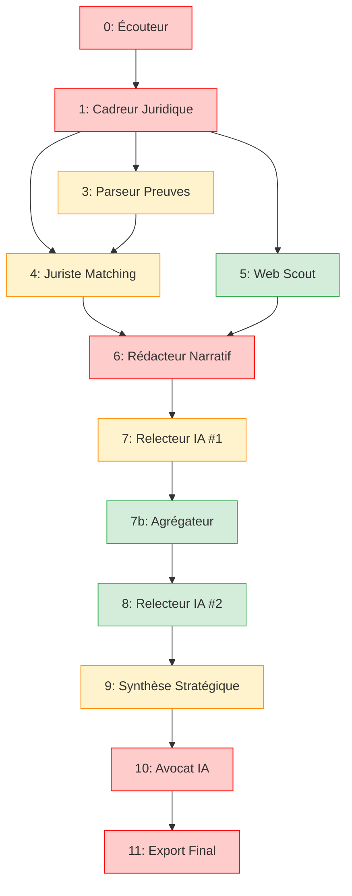

1. ✅ **Agent 0 - Écouteur** : Audio/Texte → NarrationJusticiable (avec émotions)
2. ✅ **Agent 1 - Cadreur Juridique** : Narration → Axes + Corpus Légifrance  
3. ✅ **Agent 3 - Parseur Preuves** : Multi-drivers (email, PDF, OCR, virtuel) + anonymisation
4. ✅ **Agent 4 - Juriste Matching** : FAISS embeddings pour relier pièces ↔ articles
5. ✅ **Agent 5 - Web Scout** : Recherche web ciblée (associations, jurisprudence)

**Prochains agents à documenter** :
- **Agent 6** - Rédacteur Narratif (GPT-4o long-form)
- **Agent 7** - Relecteur IA #1 (QA technique)
- **Agent 7b** - Agrégateur Cohérence (contrôle coverage)
- **Agent 8** - Relecteur IA #2 (divergent)
- **Agent 9** - Synthèse Stratégique (scoring)
- **Agent 10** - Avocat IA (requête finale)
- **Agent 11** - Export Final (PDF + ZIP)

---

## ✍️ 7. AGENT 6 - Rédacteur Narratif

### 7.1 Fiche d'identité

| **Champ** | **Valeur** |
|-----------|------------|
| **ID** | `redacteur_narratif` |
| **Classe** | `RedacteurNarratifNode` |
| **Fichier** | `src/defenseur_ia/agents/06_redacteur_narratif.py` |
| **Criticité** | 🔴 **Critique** (cœur du système) |
| **Inputs** | `narration`, `matches`, `web_corpus` |
| **Outputs** | `draft.v0: DraftNarratif` |
| **Services externes** | GPT-4o (gestion longue fenêtre) |
| **Durée typique** | 20-40s |

### 7.2 Algorithme de rédaction narrative

```python
class RedacteurNarratifNode(BaseNode):
    id = "redacteur_narratif"
    
    async def exec(self, ctx: NodeContext) -> None:
        # Collecte de tous les éléments disponibles
        narration = await ctx.shared.get("narration")
        matches = await ctx.shared.get("matches", [])
        web_corpus = await ctx.shared.get("web_corpus", [])
        pieces = await ctx.shared.get("pieces", [])
        axes = await ctx.shared.get("axes", [])
        
        if not narration:
            raise RedactionError("Aucune narration disponible pour la rédaction")
        
        # Construction du contexte enrichi pour GPT-4o
        context = await self._build_redaction_context(
            narration, matches, web_corpus, pieces, axes
        )
        
        # Génération du draft via LLM
        draft_content = await self._generate_narrative_draft(context)
        
        # Post-traitement et structuration
        draft = DraftNarratif(
            version="v0",
            texte_markdown=draft_content,
            tokens_llm=self._count_tokens(draft_content),
            date_creation=datetime.now().isoformat(),
            sources_utilisees=self._extract_sources_used(matches, web_corpus),
            structure_sections=self._analyze_structure(draft_content)
        )
        
        # Mise à jour du SharedStore
        await ctx.shared.set("draft", {"v0": draft, "latest": "v0"})

    async def _build_redaction_context(self, narration, matches, web_corpus, pieces, axes) -> dict:
        """Construit le contexte complet pour la rédaction"""
        
        context = {
            "recit_initial": self._format_narration(narration),
            "axes_juridiques": [axe.axe for axe in axes],
            "pieces_disponibles": self._format_pieces_for_context(pieces),
            "articles_pertinents": self._format_matches_for_context(matches),
            "ressources_complementaires": self._format_web_resources(web_corpus),
            "meta": {
                "nb_pieces": len(pieces),
                "nb_articles": len(matches),
                "nb_ressources_web": len(web_corpus)
            }
        }
        
        return context

    def _format_narration(self, narration) -> str:
        """Formate la narration pour le prompt LLM"""
        
        segments_text = []
        for i, segment in enumerate(narration.segments, 1):
            emotion_indicator = f" [{segment.emotion}]" if segment.emotion != "neutral" else ""
            segments_text.append(f"{i}. {segment.text}{emotion_indicator}")
        
        return "\n".join(segments_text)

    def _format_pieces_for_context(self, pieces) -> List[dict]:
        """Formate les pièces pour inclusion dans le prompt"""
        
        formatted_pieces = []
        for piece in pieces:
            if piece.is_virtual:
                status = "⚠️ PIÈCE VIRTUELLE"
            else:
                status = "✅ Disponible"
            
            formatted_pieces.append({
                "annexe": piece.annexe_num,
                "titre": piece.titre,
                "resume": piece.resume,
                "type": piece.type_piece,
                "date": piece.date,
                "status": status
            })
        
        return formatted_pieces

    def _format_matches_for_context(self, matches) -> List[dict]:
        """Formate les correspondances pièces-articles pour le prompt"""
        
        formatted_matches = []
        for match in matches[:15]:  # Limite pour éviter surcharge
            formatted_matches.append({
                "piece": match.piece_titre,
                "article": f"{match.article_num} - {match.article_titre}",
                "pertinence": match.display_score(),
                "justification": match.justification,
                "url": match.source_url
            })
        
        return formatted_matches

    def _format_web_resources(self, web_corpus) -> List[dict]:
        """Formate les ressources web pour le contexte"""
        
        formatted_resources = []
        for resource in web_corpus[:10]:  # Top 10 seulement
            formatted_resources.append({
                "titre": resource.titre,
                "source": resource.display_credibility(),
                "pertinence": f"{resource.score_pertinence:.1f}/1.0",
                "extrait": resource.snippet[:200] + "...",
                "url": resource.url
            })
        
        return formatted_resources

    async def _generate_narrative_draft(self, context: dict) -> str:
        """Génère le draft narratif via GPT-4o"""
        
        prompt = self._build_master_prompt(context)
        
        try:
            response = await openai_client.chat.completions.create(
                model="gpt-4o",
                messages=[
                    {
                        "role": "system",
                        "content": self._get_system_prompt()
                    },
                    {
                        "role": "user", 
                        "content": prompt
                    }
                ],
                max_tokens=4000,
                temperature=0.3,  # Créativité modérée mais cohérence
                presence_penalty=0.1,
                frequency_penalty=0.1
            )
            
            return response.choices[0].message.content.strip()
            
        except Exception as e:
            logger.error("llm_redaction_failed", error=str(e))
            raise RedactionError(f"Échec génération narrative: {str(e)}")

    def _get_system_prompt(self) -> str:
        """Prompt système pour configurer le rôle de rédacteur juridique"""
        
        return """Tu es un rédacteur juridique spécialisé dans le droit des étrangers. 
Ton rôle est de transformer un témoignage brut en récit structuré et argumenté pour un recours administratif.

STYLE REQUIS:
- Ton empathique mais factuel
- Chronologie claire et logique  
- Citations précises des articles de loi
- Références aux pièces justificatives (Annexe X)
- Langage accessible mais juridiquement rigoureux

STRUCTURE À RESPECTER:
1. Contexte personnel et familial
2. Chronologie des faits
3. Analyse juridique par axe
4. Conclusion et demandes

RÈGLES IMPORTANTES:
- Chaque fait important doit être étayé par une pièce (Annexe X)
- Cite les articles de loi avec précision
- Évite le jargon excessif
- Garde l'émotion humaine tout en restant professionnel
- Utilise le markdown pour la structure"""

    def _build_master_prompt(self, context: dict) -> str:
        """Construit le prompt principal avec tout le contexte"""
        
        prompt_parts = [
            "# MISSION : Rédiger un récit argumenté pour recours administratif",
            "",
            "## TÉMOIGNAGE INITIAL",
            context["recit_initial"],
            "",
            "## AXES JURIDIQUES IDENTIFIÉS"
        ]
        
        for i, axe in enumerate(context["axes_juridiques"], 1):
            prompt_parts.append(f"{i}. {axe}")
        
        prompt_parts.extend([
            "",
            "## PIÈCES JUSTIFICATIVES DISPONIBLES"
        ])
        
        for piece in context["pieces_disponibles"]:
            prompt_parts.append(
                f"- **{piece['annexe']}**: {piece['titre']} ({piece['type']}, {piece['date']}) {piece['status']}"
            )
            prompt_parts.append(f"  Résumé: {piece['resume']}")
        
        if context["articles_pertinents"]:
            prompt_parts.extend([
                "",
                "## ARTICLES DE LOI PERTINENTS"
            ])
            
            for match in context["articles_pertinents"][:10]:
                prompt_parts.append(f"- **{match['article']}** {match['pertinence']}")
                prompt_parts.append(f"  Lien avec: {match['piece']}")
                prompt_parts.append(f"  Justification: {match['justification']}")
        
        if context["ressources_complementaires"]:
            prompt_parts.extend([
                "",
                "## RESSOURCES COMPLÉMENTAIRES"
            ])
            
            for resource in context["ressources_complementaires"]:
                prompt_parts.append(f"- **{resource['titre']}** {resource['source']}")
                prompt_parts.append(f"  Extrait: {resource['extrait']}")
        
        prompt_parts.extend([
            "",
            "## INSTRUCTIONS DE RÉDACTION",
            "",
            "Rédige un récit structuré en markdown qui :",
            "1. **Contextualise** la situation personnelle et familiale",
            "2. **Chronologie** claire des événements avec dates",
            "3. **Analyse juridique** pour chaque axe identifié",
            "4. **Étaie chaque fait** par une référence à l'annexe correspondante",
            "5. **Cite les articles de loi** pertinents avec précision",
            "6. **Conclut** avec les demandes claires",
            "",
            "**IMPORTANT**: ",
            "- Utilise EXACTEMENT les noms d'annexes fournis (ex: 'Annexe 3')",
            "- Cite les articles sous la forme 'Article L.XXX-X du Code...'",
            "- Garde un ton professionnel mais humain",
            "- Structure avec des titres markdown (##, ###)",
            "",
            "**RÉCIT ARGUMENTÉ:**"
        ])
        
        return "\n".join(prompt_parts)

    def _count_tokens(self, text: str) -> int:
        """Estimation du nombre de tokens (approximation)"""
        # Approximation : 1 token ≈ 0.75 mot en français
        word_count = len(text.split())
        return int(word_count / 0.75)

    def _extract_sources_used(self, matches, web_corpus) -> List[str]:
        """Extrait la liste des sources utilisées"""
        sources = []
        
        # Articles de loi
        for match in matches:
            sources.append(f"Article {match.article_num} - {match.source_url}")
        
        # Ressources web
        for resource in web_corpus:
            sources.append(f"{resource.titre} - {resource.url}")
        
        return sources[:20]  # Limite

    def _analyze_structure(self, content: str) -> dict:
        """Analyse la structure du document généré"""
        
        lines = content.split('\n')
        structure = {
            "titres_h1": [],
            "titres_h2": [],
            "titres_h3": [],
            "nb_paragraphes": 0,
            "nb_listes": 0,
            "references_annexes": [],
            "citations_articles": []
        }
        
        for line in lines:
            line = line.strip()
            if line.startswith('# '):
                structure["titres_h1"].append(line[2:])
            elif line.startswith('## '):
                structure["titres_h2"].append(line[3:])
            elif line.startswith('### '):
                structure["titres_h3"].append(line[4:])
            elif line.startswith('- ') or line.startswith('* '):
                structure["nb_listes"] += 1
            elif len(line) > 50 and not line.startswith('#'):
                structure["nb_paragraphes"] += 1
        
        # Extraction références
        import re
        annexe_refs = re.findall(r'Annexe \d+', content)
        structure["references_annexes"] = list(set(annexe_refs))
        
        article_refs = re.findall(r'[Aa]rticle L\.\d+-\d+', content)
        structure["citations_articles"] = list(set(article_refs))
        
        return structure
```

### 7.3 Modèle DraftNarratif

```python
class DraftNarratif(BaseModel):
    version: str
    texte_markdown: str
    tokens_llm: int
    date_creation: str
    sources_utilisees: List[str] = []
    structure_sections: dict = {}
    qualite_score: Optional[float] = None  # Calculé par relecteurs
    
    @property
    def longueur_lisible(self) -> str:
        """Longueur en format lisible"""
        chars = len(self.texte_markdown)
        if chars < 1000:
            return f"{chars} caractères"
        elif chars < 10000:
            return f"{chars/1000:.1f}k caractères"
        else:
            return f"{chars/1000:.0f}k caractères"
    
    @property
    def temps_lecture_estime(self) -> str:
        """Temps de lecture estimé"""
        mots = len(self.texte_markdown.split())
        minutes = max(1, mots // 200)  # 200 mots/min
        return f"{minutes} min de lecture"
```

---

## 🔍 8. AGENT 7 - Relecteur IA #1 (QA Technique)

### 8.1 Fiche d'identité

| **Champ** | **Valeur** |
|-----------|------------|
| **ID** | `relecteur_1` |
| **Classe** | `Relecteur1Node` |
| **Fichier** | `src/defenseur_ia/agents/07_relecteur1.py` |
| **Criticité** | 🟡 **Important** |
| **Inputs** | `draft.v0: DraftNarratif` |
| **Outputs** | `draft.v1: DraftCorrige` |
| **Services externes** | GPT-4o (mode critique) |
| **Durée typique** | 15-25s |

### 8.2 Checklist de relecture automatique

```python
class Relecteur1Node(BaseNode):
    id = "relecteur_1"
    
    def __init__(self):
        self.checklist_items = [
            "coherence_chronologique",
            "references_annexes_valides", 
            "citations_articles_exactes",
            "structure_logique",
            "ton_professionnel",
            "orthographe_grammaire",
            "completude_axes",
            "clarte_demandes"
        ]
    
    async def exec(self, ctx: NodeContext) -> None:
        draft_v0 = await ctx.shared.get("draft", {}).get("v0")
        
        if not draft_v0:
            raise RelecturError("Pas de draft v0 disponible")
        
        # 1. Vérifications automatiques
        auto_checks = await self._run_automatic_checks(draft_v0, ctx.shared)
        
        # 2. Relecture critique via LLM
        suggestions = await self._llm_critical_review(draft_v0)
        
        # 3. Correction du texte si nécessaire
        corrected_text = await self._apply_corrections(draft_v0.texte_markdown, suggestions)
        
        # 4. Construction du draft corrigé
        draft_v1 = DraftCorrige(
            version="v1",
            texte_markdown=corrected_text,
            tokens_llm=self._count_tokens(corrected_text),
            date_creation=datetime.now().isoformat(),
            sources_utilisees=draft_v0.sources_utilisees,
            structure_sections=self._analyze_structure(corrected_text),
            suggestions=suggestions,
            checks_results=auto_checks,
            corrections_applied=len(suggestions)
        )
        
        # 5. Mise à jour SharedStore
        drafts = await ctx.shared.get("draft", {})
        drafts["v1"] = draft_v1
        drafts["latest"] = "v1"
        await ctx.shared.set("draft", drafts)

    async def _run_automatic_checks(self, draft: DraftNarratif, shared: SharedStore) -> dict:
        """Exécute les vérifications automatiques"""
        
        results = {}
        text = draft.texte_markdown
        
        # Check 1: Cohérence chronologique
        results["coherence_chronologique"] = self._check_chronology(text)
        
        # Check 2: Références aux annexes valides
        pieces = await shared.get("pieces", [])
        results["references_annexes_valides"] = self._check_annexe_references(text, pieces)
        
        # Check 3: Citations d'articles exactes
        legal_corpus = await shared.get("legal_corpus", [])
        results["citations_articles_exactes"] = self._check_article_citations(text, legal_corpus)
        
        # Check 4: Structure logique
        results["structure_logique"] = self._check_document_structure(text)
        
        # Check 5: Longueur appropriée
        results["longueur_appropriee"] = self._check_document_length(text)
        
        return results

    def _check_chronology(self, text: str) -> dict:
        """Vérifie la cohérence chronologique"""
        
        import re
        from datetime import datetime
        
        # Extraction des dates mentionnées
        date_patterns = [
            r'\b(\d{1,2})[/-](\d{1,2})[/-](\d{4})\b',  # DD/MM/YYYY
            r'\b(\d{4})[/-](\d{1,2})[/-](\d{1,2})\b',  # YYYY/MM/DD
            r'\b(janvier|février|mars|avril|mai|juin|juillet|août|septembre|octobre|novembre|décembre)\s+(\d{4})\b'
        ]
        
        dates_found = []
        for pattern in date_patterns:
            matches = re.finditer(pattern, text, re.IGNORECASE)
            for match in matches:
                dates_found.append({
                    "text": match.group(),
                    "position": match.start()
                })
        
        # Analyse chronologique basique
        chronology_issues = []
        if len(dates_found) > 1:
            # Vérifier que les dates sont globalement en ordre chronologique
            pass  # Implémentation simplifiée
        
        return {
            "status": "ok" if len(chronology_issues) == 0 else "warning",
            "dates_found": len(dates_found),
            "issues": chronology_issues
        }

    def _check_annexe_references(self, text: str, pieces: List) -> dict:
        """Vérifie que les références aux annexes sont valides"""
        
        import re
        
        # Extraction des références dans le texte
        annexe_refs_in_text = re.findall(r'Annexe \d+', text)
        
        # Annexes réellement disponibles
        annexes_disponibles = [piece.annexe_num for piece in pieces]
        
        # Détection des références invalides
        invalid_refs = []
        for ref in set(annexe_refs_in_text):
            if ref not in annexes_disponibles:
                invalid_refs.append(ref)
        
        # Détection des annexes non référencées
        unreferenced_annexes = []
        for annexe in annexes_disponibles:
            if annexe not in annexe_refs_in_text:
                unreferenced_annexes.append(annexe)
        
        status = "ok"
        if invalid_refs or unreferenced_annexes:
            status = "warning" if len(invalid_refs) <= 2 else "error"
        
        return {
            "status": status,
            "references_found": len(set(annexe_refs_in_text)),
            "invalid_references": invalid_refs,
            "unreferenced_annexes": unreferenced_annexes
        }

    def _check_article_citations(self, text: str, legal_corpus: List) -> dict:
        """Vérifie l'exactitude des citations d'articles"""
        
        import re
        
        # Articles cités dans le texte
        article_refs = re.findall(r'[Aa]rticle (L\.\d+-\d+)', text)
        
        # Articles disponibles dans le corpus
        articles_disponibles = [article.num for article in legal_corpus]
        
        # Vérification des citations
        unknown_articles = []
        for article_ref in set(article_refs):
            if article_ref not in articles_disponibles:
                unknown_articles.append(article_ref)
        
        return {
            "status": "ok" if len(unknown_articles) == 0 else "warning",
            "citations_found": len(set(article_refs)),
            "unknown_articles": unknown_articles
        }

    def _check_document_structure(self, text: str) -> dict:
        """Vérifie la structure du document"""
        
        lines = text.split('\n')
        structure_elements = {
            "titles_h1": 0,
            "titles_h2": 0, 
            "titles_h3": 0,
            "paragraphs": 0,
            "lists": 0
        }
        
        for line in lines:
            line = line.strip()
            if line.startswith('# '):
                structure_elements["titles_h1"] += 1
            elif line.startswith('## '):
                structure_elements["titles_h2"] += 1
            elif line.startswith('### '):
                structure_elements["titles_h3"] += 1
            elif line.startswith('- ') or line.startswith('* '):
                structure_elements["lists"] += 1
            elif len(line) > 50:
                structure_elements["paragraphs"] += 1
        
        # Évaluation de la structure
        issues = []
        if structure_elements["titles_h2"] < 2:
            issues.append("Manque de sections principales (##)")
        if structure_elements["paragraphs"] < 5:
            issues.append("Document trop court")
        
        return {
            "status": "ok" if len(issues) == 0 else "warning",
            "structure": structure_elements,
            "issues": issues
        }

    async def _llm_critical_review(self, draft: DraftNarratif) -> List[str]:
        """Relecture critique via LLM"""
        
        prompt = f"""Analyse ce draft juridique et propose des améliorations CONCRÈTES.

DRAFT À ANALYSER:
{draft.texte_markdown}

MISSION: Identifier les problèmes et proposer des corrections spécifiques.

POINTS À VÉRIFIER:
1. **Cohérence logique**: La progression est-elle claire ?
2. **Ton juridique**: Le style est-il approprié ?
3. **Précision factuelle**: Les faits sont-ils clairs et datés ?
4. **Force argumentaire**: Les arguments sont-ils convaincants ?
5. **Références**: Citations et annexes sont-elles correctes ?

FORMAT DE RÉPONSE:
Pour chaque problème identifié, donne:
- **Problème**: [description courte]
- **Suggestion**: [correction concrète]

SUGGESTIONS D'AMÉLIORATION:"""

        try:
            response = await openai_client.chat.completions.create(
                model="gpt-4o",
                messages=[
                    {
                        "role": "system",
                        "content": "Tu es un relecteur juridique expert. Donne des critiques constructives et des suggestions précises."
                    },
                    {
                        "role": "user",
                        "content": prompt
                    }
                ],
                max_tokens=1500,
                temperature=0.2
            )
            
            # Parsing des suggestions
            suggestions_text = response.choices[0].message.content
            suggestions = self._parse_suggestions(suggestions_text)
            
            return suggestions
            
        except Exception as e:
            logger.error("llm_review_failed", error=str(e))
            return ["Erreur lors de la relecture automatique"]

    def _parse_suggestions(self, suggestions_text: str) -> List[str]:
        """Parse les suggestions du LLM en liste structurée"""
        
        lines = suggestions_text.split('\n')
        suggestions = []
        current_suggestion = ""
        
        for line in lines:
            line = line.strip()
            if line.startswith('**Problème**') or line.startswith('**Suggestion**'):
                if current_suggestion:
                    suggestions.append(current_suggestion.strip())
                current_suggestion = line
            elif line and current_suggestion:
                current_suggestion += " " + line
        
        if current_suggestion:
            suggestions.append(current_suggestion.strip())
        
        return suggestions[:10]  # Limite à 10 suggestions

    async def _apply_corrections(self, original_text: str, suggestions: List[str]) -> str:
        """Applique des corrections automatiques si possibles"""
        
        corrected_text = original_text
        
        # Corrections automatiques simples
        corrections = [
            # Espaces avant ponctuation
            (r'\s+([,.;:!?])', r'\1'),
            # Doubles espaces
            (r'\s{2,}', r' '),
            # Formatage des références d'articles
            (r'article\s+(L\.\d+-\d+)', r'Article \1'),
            # Formatage des annexes
            (r'annexe\s+(\d+)', r'Annexe \1')
        ]
        
        for pattern, replacement in corrections:
            corrected_text = re.sub(pattern, replacement, corrected_text, flags=re.IGNORECASE)
        
        return corrected_text
```

### 8.3 Modèle DraftCorrige

```python
class DraftCorrige(DraftNarratif):
    suggestions: List[str] = []
    checks_results: dict = {}
    corrections_applied: int = 0
    qualite_score: Optional[float] = None
    
    def calculate_quality_score(self) -> float:
        """Calcule un score de qualité basé sur les vérifications"""
        
        if not self.checks_results:
            return 0.5
        
        score = 1.0
        
        # Pénalités selon les checks
        for check_name, result in self.checks_results.items():
            if result.get("status") == "error":
                score -= 0.2
            elif result.get("status") == "warning":
                score -= 0.1
        
        # Bonus pour nombre approprié de corrections
        if 1 <= self.corrections_applied <= 5:
            score += 0.1
        elif self.corrections_applied > 10:
            score -= 0.1
        
        return max(0.0, min(1.0, score))
    
    @property
    def resume_qualite(self) -> str:
        """Résumé de la qualité du draft"""
        score = self.qualite_score or self.calculate_quality_score()
        
        if score >= 0.8:
            return "🟢 Excellente qualité"
        elif score >= 0.6:
            return "🟡 Bonne qualité"
        elif score >= 0.4:
            return "🟠 Qualité correcte"
        else:
            return "🔴 Nécessite révision"
```

---

## 🧩 9. AGENT 7b - Agrégateur Cohérence

### 9.1 Fiche d'identité

| **Champ** | **Valeur** |
|-----------|------------|
| **ID** | `agregateur_coherence` |
| **Classe** | `AgregateurNode` |
| **Fichier** | `src/defenseur_ia/agents/07b_agregateur.py` |
| **Criticité** | 🟢 **Optionnel** mais recommandé |
| **Inputs** | `draft.v1`, `axes`, `pieces` |
| **Outputs** | `draft.v1b` ou signal de re-recherche |
| **Services externes** | Aucun (logique pure) |
| **Durée typique** | 2-5s |

### 9.2 Contrôle de couverture axes ↔ preuves

```python
class AgregateurNode(BaseNode):
    id = "agregateur_coherence"
    
    async def exec(self, ctx: NodeContext) -> None:
        draft_v1 = await ctx.shared.get("draft", {}).get("v1")
        axes = await ctx.shared.get("axes", [])
        pieces = await ctx.shared.get("pieces", [])
        
        if not draft_v1:
            raise AgregateurError("Pas de draft v1 disponible")### 4.4 Algorithme principal unifié

```python
class ParseurPreuvesNode(BaseNode):
    id = "parseur_preuves"
    
    def __init__(self):
        self.drivers = {
            "email": self._parse_email,
            "pdf": self._parse_pdf, 
            "image": self._parse_image,
            "docx": self._parse_docx,
            "txt": self._parse_text,
            "audio": self._parse_audio,
            "chat": self._parse_chat,
            "virtual": self._create_virtual_piece
        }
    
    async def exec(self, ctx: NodeContext) -> None:
        pieces_raw = await ctx.shared.get("pieces_raw_paths", [])
        virtual_pieces = await ctx.shared.get("virtual_pieces_requests", [])
        
        pieces_parsed = []
        annexe_counter = 1
        
        # 1. Traitement des fichiers physiques
        for file_path in pieces_raw:
            try:
                piece = await self._route_and_parse(file_path, annexe_counter)
                pieces_parsed.append(piece)
                annexe_counter += 1
            except Exception as e:
                logger.error("parse_failed", file=file_path, error=str(e))
                # Création pièce d'erreur pour ne pas bloquer
                piece_error = await self._create_error_piece(file_path, annexe_counter, str(e))
                pieces_parsed.append(piece_error)
                annexe_counter += 1
        
        # 2. Traitement des pièces virtuelles
        for virtual_request in virtual_pieces:
            piece_virtual = await self._create_virtual_piece(virtual_request, annexe_counter)
            pieces_parsed.append(piece_virtual)
            annexe_counter += 1
        
        # 3. Post-traitement : anonymisation et résumé
        for piece in pieces_parsed:
            piece.texte_anonymise, piece.entites = await self._anonymize_text(piece.texte_brut)
            piece.resume = await self._summarize_piece(piece.texte_anonymise)
        
        await ctx.shared.set("pieces", pieces_parsed)

    async def _route_and_parse(self, file_path: str, annexe_num: int) -> PieceParsed:
        """Router intelligent qui sélectionne le bon driver"""
        
        # Détection du type de fichier
        mime_type = self._detect_mime_type(file_path)
        file_ext = Path(file_path).suffix.lower()
        
        # Sélection du driver approprié
        if mime_type.startswith("image/") or file_ext in [".jpg", ".jpeg", ".png", ".tiff"]:
            driver_key = "image"
        elif file_ext == ".pdf":
            driver_key = "pdf"
        elif file_ext in [".eml", ".msg"]:
            driver_key = "email"
        elif file_ext in [".docx", ".doc"]:
            driver_key = "docx"
        elif file_ext in [".txt", ".rtf"]:
            driver_key = "txt"
        elif file_ext in [".mp3", ".wav", ".m4a", ".ogg"]:
            driver_key = "audio"
        elif file_ext in [".json", ".csv"] and "chat" in Path(file_path).name.lower():
            driver_key = "chat"
        else:
            # Fallback vers texte
            driver_key = "txt"
        
        # Appel du driver
        raw_data, meta_extra = await self.drivers[driver_key](file_path)
        
        # Construction de l'objet PieceParsed standardisé
        piece = PieceParsed(
            id_piece=f"piece_{annexe_num:03d}",
            annexe_num=f"Annexe {annexe_num}",
            type_piece=driver_key,
            date=meta_extra.get("date_detected", ""),
            titre=meta_extra.get("titre", Path(file_path).stem),
            texte_brut=raw_data,
            texte_anonymise="",  # Sera rempli par post-traitement
            resume="",  # Sera rempli par post-traitement
            entites=[],  # Sera rempli par anonymisation
            meta_extra=meta_extra,
            chemin_fichier=str(file_path),
            is_virtual=False
        )
        
        return piece
```

### 4.5 Drivers spécialisés

#### 4.5.1 DriverEmail - Emails (.eml/.msg)

```python
async def _parse_email(self, file_path: str) -> tuple[str, dict]:
    """Parse email avec extraction complète des métadonnées"""
    
    try:
        # Support .eml et .msg
        if file_path.endswith('.eml'):
            mail = mailparser.parse_from_file(file_path)
        else:  # .msg
            import extract_msg
            msg = extract_msg.Message(file_path)
            mail = self._convert_msg_to_mailparser(msg)
        
        # Construction du texte structuré
        content_parts = []
        
        # En-têtes essentiels
        content_parts.append("=== MÉTADONNÉES EMAIL ===")
        content_parts.append(f"De: {mail.from_}")
        content_parts.append(f"À: {'; '.join(mail.to) if mail.to else 'Non spécifié'}")
        if mail.cc:
            content_parts.append(f"Copie: {'; '.join(mail.cc)}")
        content_parts.append(f"Objet: {mail.subject}")
        content_parts.append(f"Date: {mail.date}")
        
        # Thread/Conversation ID si disponible
        if hasattr(mail, 'message_id'):
            content_parts.append(f"Message-ID: {mail.message_id}")
        
        content_parts.append("")  # Ligne vide
        
        # Corps du message
        content_parts.append("=== CORPS DU MESSAGE ===")
        if mail.body:
            content_parts.append(mail.body)
        elif hasattr(mail, 'text_plain') and mail.text_plain:
            content_parts.append(mail.text_plain[0])
        
        # Pièces jointes (liste + extraction si texte)
        if mail.attachments:
            content_parts.append("")
            content_parts.append("=== PIÈCES JOINTES ===")
            for i, attachment in enumerate(mail.attachments):
                filename = attachment.get('filename', f'attachment_{i}')
                size = attachment.get('size', 0)
                content_parts.append(f"- {filename} ({size} bytes)")
                
                # Si PJ est du texte, on l'intègre
                if attachment.get('content_type', '').startswith('text/'):
                    try:
                        att_content = attachment.get('payload', '').decode('utf-8', errors='ignore')
                        if att_content and len(att_content) < 5000:  # Limite
                            content_parts.append(f"  Contenu de {filename}:")
                            content_parts.append(f"  {att_content[:1000]}...")
                    except:
                        pass
        
        full_text = "\n".join(content_parts)
        
        # Métadonnées enrichies
        meta = {
            "method": "email_parser",
            "from": str(mail.from_),
            "to": mail.to,
            "subject": str(mail.subject),
            "date_email": str(mail.date),
            "date_detected": self._extract_date_from_email(mail),
            "titre": f"Email: {mail.subject[:50]}...",
            "attachments_count": len(mail.attachments) if mail.attachments else 0,
            "thread_id": getattr(mail, 'message_id', None),
            "importance": self._detect_email_importance(mail)
        }
        
        return full_text, meta
        
    except Exception as e:
        raise EmailParsingError(f"Échec parsing email {file_path}: {str(e)}")

def _extract_date_from_email(self, mail) -> str:
    """Extrait la date principale de l'email"""
    if mail.date:
        try:
            # Conversion en format ISO
            return mail.date.strftime("%Y-%m-%d") if hasattr(mail.date, 'strftime') else str(mail.date)[:10]
        except:
            pass
    return ""

def _detect_email_importance(self, mail) -> str:
    """Détecte l'importance d'un email (administrative, urgente, etc.)"""
    subject_lower = str(mail.subject).lower()
    
    if any(word in subject_lower for word in ["urgent", "rappel", "mise en demeure", "oqtf"]):
        return "haute"
    elif any(word in subject_lower for word in ["confirmation", "accusé", "reçu"]):
        return "administrative"
    else:
        return "normale"
```

#### 4.5.2 DriverPDF - Documents PDF

```python
async def _parse_pdf(self, file_path: str) -> tuple[str, dict]:
    """Parse PDF avec fallback OCR intelligent"""
    
    meta = {
        "method": "unknown",
        "pages": 0,
        "has_text": False,
        "ocr_confidence": None
    }
    
    try:
        # 1. Tentative extraction texte natif
        with open(file_path, 'rb') as file:
            pdf_reader = PyPDF2.PdfReader(file)
            meta["pages"] = len(pdf_reader.pages)
            
            native_text = ""
            for page_num, page in enumerate(pdf_reader.pages):
                page_text = page.extract_text()
                native_text += f"\n--- PAGE {page_num + 1} ---\n"
                native_text += page_text
            
            # Si suffisamment de texte natif (> 100 chars), on garde
            clean_text = re.sub(r'\s+', ' ', native_text).strip()
            if len(clean_text) > 100:
                meta["method"] = "native_pdf"
                meta["has_text"] = True
                meta["chars_extracted"] = len(clean_text)
                
                # Extraction métadonnées PDF
                if pdf_reader.metadata:
                    meta["author"] = pdf_reader.metadata.get('/Author', '')
                    meta["title"] = pdf_reader.metadata.get('/Title', '')
                    meta["creation_date"] = str(pdf_reader.metadata.get('/CreationDate', ''))
                
                return native_text, meta
                
    except Exception as e:
        logger.warning("pdf_native_failed", file=file_path, error=str(e))
    
    # 2. Fallback OCR avec Tesseract
    logger.info("pdf_fallback_to_ocr", file=file_path)
    
    try:
        ocr_text, ocr_confidence = await self._ocr_pdf_advanced(file_path)
        meta.update({
            "method": "ocr",
            "ocr_confidence": ocr_confidence,
            "chars_extracted": len(ocr_text)
        })
        return ocr_text, meta
        
    except Exception as e:
        raise OCRProcessingFailed(f"Échec OCR PDF {file_path}: {str(e)}")

async def _ocr_pdf_advanced(self, file_path: str) -> tuple[str, float]:
    """OCR PDF avec préprocessing et scoring de confiance"""
    
    # Conversion PDF → images via pdf2image puis OCR
    try:
        from pdf2image import convert_from_path
        import cv2
        import numpy as np
        
        # Conversion en images
        pages = convert_from_path(file_path, dpi=300)  # Haute résolution
        
        all_text = []
        confidences = []
        
        for page_num, page_image in enumerate(pages):
            # Conversion PIL → OpenCV
            opencv_image = cv2.cvtColor(np.array(page_image), cv2.COLOR_RGB2BGR)
            
            # Préprocessing pour améliorer OCR
            processed_image = self._preprocess_image_for_ocr(opencv_image)
            
            # OCR avec scoring de confiance
            ocr_data = pytesseract.image_to_data(processed_image, 
                                               lang='fra+eng',
                                               config='--psm 6',
                                               output_type=pytesseract.Output.DICT)
            
            # Extraction texte + calcul confiance
            page_text_parts = []
            page_confidences = []
            
            for i, conf in enumerate(ocr_data['conf']):
                if int(conf) > 30:  # Seuil de confiance minimum
                    text = ocr_data['text'][i].strip()
                    if text:
                        page_text_parts.append(text)
                        page_confidences.append(int(conf))
            
            page_text = ' '.join(page_text_parts)
            all_text.append(f"\n--- PAGE {page_num + 1} ---\n{page_text}")
            
            if page_confidences:
                confidences.extend(page_confidences)
        
        # Calcul confiance globale
        avg_confidence = sum(confidences) / len(confidences) if confidences else 0
        
        return '\n'.join(all_text), avg_confidence
        
    except ImportError:
        # Fallback vers méthode Docker si pdf2image non disponible
        return await self._ocr_pdf_docker(file_path)

def _preprocess_image_for_ocr(self, image):
    """Préprocessing d'image pour améliorer la qualité OCR"""
    
    # Conversion en niveaux de gris
    gray = cv2.cvtColor(image, cv2.COLOR_BGR2GRAY)
    
    # Débruitage
    denoised = cv2.fastNlMeansDenoising(gray)
    
    # Binarisation adaptative
    binary = cv2.adaptiveThreshold(denoised, 255, cv2.ADAPTIVE_THRESH_GAUSSIAN_C, 
                                  cv2.THRESH_BINARY, 11, 2)
    
    # Correction de l'inclinaison (deskew) - méthode simple
    coords = np.column_stack(np.where(binary > 0))
    if len(coords) > 100:
        angle = cv2.minAreaRect(coords)[-1]
        if angle < -45:
            angle = -(90 + angle)
        else:
            angle = -angle
            
        if abs(angle) > 0.5:  # Correction si inclinaison > 0.5°
            (h, w) = binary.shape[:2]
            center = (w // 2, h // 2)
            M = cv2.getRotationMatrix2D(center, angle, 1.0)
            binary = cv2.warpAffine(binary, M, (w, h), flags=cv2.INTER_CUBIC, 
                                  borderMode=cv2.BORDER_REPLICATE)
    
    return binary
```

#### 4.5.3 DriverVirtuel - Pièces déclaratives

```python
async def _create_virtual_piece(self, virtual_request: dict, annexe_num: int) -> PieceParsed:
    """Crée une pièce virtuelle basée sur une déclaration utilisateur"""
    
    # Structure d'une demande de pièce virtuelle :
    # {
    #   "titre": "Attestation impossibilité paiement frais scolarité",
    #   "description": "En mai 2016, impossibilité de payer les frais...",
    #   "date_evenement": "2016-05",
    #   "type_attendu": "facture|attestation|courrier|autre",
    #   "statut": "placeholder|definitif|recherche_en_cours"
    # }
    
    titre = virtual_request.get("titre", f"Pièce virtuelle {annexe_num}")
    description = virtual_request.get("description", "")
    date_evt = virtual_request.get("date_evenement", "")
    type_attendu = virtual_request.get("type_attendu", "document")
    statut = virtual_request.get("statut", "placeholder")
    
    # Construction du texte formaté
    texte_virtuel = f"""=== PIÈCE VIRTUELLE ===
Titre: {titre}
Date de l'événement: {date_evt}
Type de document attendu: {type_attendu}
Statut: {statut}

=== DESCRIPTION ===
{description}

=== NOTE SYSTÈME ===
Cette pièce est une déclaration sur l'honneur en attente du document réel.
Merci de fournir le document original dès que possible ou de confirmer 
son inexistence si applicable.
"""
    
    # Métadonnées spéciales pour pièces virtuelles
    meta_extra = {
        "method": "virtual_creation",
        "type_attendu": type_attendu,
        "statut_virtuel": statut,
        "date_creation": datetime.now().isoformat(),
        "needs_replacement": statut in ["placeholder", "recherche_en_cours"]
    }
    
    piece = PieceParsed(
        id_piece=f"virtual_{annexe_num:03d}",
        annexe_num=f"Annexe {annexe_num} (VIRTUELLE)",
        type_piece="virtuel",
        date=date_evt,
        titre=titre,
        texte_brut=texte_virtuel,
        texte_anonymise="",  # Sera traité par post-processing
        resume=f"Pièce virtuelle: {titre}",
        entites=[],
        meta_extra=meta_extra,
        chemin_fichier=None,
        is_virtual=True
    )
    
    return piece
```

### 4.6 Post-traitement unifié

#### 4.6.1 Anonymisation intelligente

```python
async def _anonymize_text(self, text: str) -> tuple[str, List[dict]]:
    """Anonymisation en 2 passes : regex + LLM"""
    
    entites_detectees = []
    
    # 1. Patterns regex de base
    regex_patterns = [
        (r'\b[A-Z][a-z]+ [A-Z][a-z]+\b', 'PERSON_X'),
        (r'\b(?:0[1-9]|[1-9]\d)[\s.-]?\d{2}[\s.-]?\d{2}[\s.-]?\d{2}[\s.-]?\d{2}\b', 'PHONE_X'),
        (r'\b[A-Z]{1,2}\d{2,3}[A-Z]{2}\b', 'PLATE_X'),
        (r'\b\d{1,2}[/-]\d{1,2}[/-]\d{2,4}\b', 'DATE_X'),
        (r'\b[a-zA-Z0-9._%+-]+@[a-zA-Z0-9.-]+\.[a-zA-Z]{2,}\b', 'EMAIL_X'),
        (r'\b\d{1,5}\s+[A-Za-z\s]+(?:rue|avenue|boulevard|place|impasse)\b', 'ADRESSE_X')
    ]
    
    anonymized_text = text
    for pattern, replacement in regex_patterns:
        matches = re.finditer(pattern, anonymized_text, re.IGNORECASE)
        for match in matches:
            entites_detectees.append({
                "original": match.group(),
                "anonymized": replacement,
                "type": replacement.split('_')[0].lower(),
                "position": (match.start(), match.end())
            })
        anonymized_text = re.sub(pattern, replacement, anonymized_text, flags=re.IGNORECASE)
    
    # 2. Pass LLM pour cas complexes (adresses complètes, situations spécifiques)
    if len(text) > 200:  # Seulement si texte assez long
        try:
            llm_result = await self._llm_anonymize_complex(anonymized_text)
            if llm_result and len(llm_result) > 50:
                anonymized_text = llm_result
        except Exception as e:
            logger.warning("llm_anonymization_failed", error=str(e))
    
    return anonymized_text, entites_detectees

async def _llm_anonymize_complex(self, text: str) -> str:
    """Anonymisation LLM pour cas complexes non couverts par regex"""
    
    prompt = f"""Anonymise ce texte en remplaçant toute donnée personnelle par des placeholders génériques.

RÈGLES:
- Noms de personnes → PERSON_X, PERSON_Y, etc.
- Adresses complètes → ADRESSE_X  
- Noms d'entreprises → COMPANY_X
- Numéros de dossier → DOSSIER_X
- Garde les dates et montants (importants pour le juridique)
- Garde la structure et le sens du texte

TEXTE À ANONYMISER:
{text}

TEXTE ANONYMISÉ:"""

    try:
        response = await openai_client.chat.completions.create(
            model="gpt-4o-mini",  # Modèle moins cher pour cette tâche
            messages=[{"role": "user", "content": prompt}],
            max_tokens=len(text) // 2 + 100,
            temperature=0.1
        )
        return response.choices[0].message.content.strip()
        
    except Exception as e:
        logger.error("llm_anonymization_error", error=str(e))
        return text  # Fallback : texte original
```

#### 4.6.2 Résumé automatique

```python
async def _summarize_piece(self, text: str) -> str:
    """Génère un résumé de 2-3 phrases pour chaque pièce"""
    
    if len(text.strip()) < 100:
        return text.strip()[:200] + "..."
    
    # Prompt spécialisé pour résumés de pièces juridiques
    prompt = f"""Résume cette pièce juridique en 2-3 phrases maximum, en gardant:
- Le type de document (email, facture, courrier...)
- La date ou période concernée  
- Le fait principal/l'information clé
- L'utilité potentielle pour le dossier

PIÈCE:
{text[:2000]}...

RÉSUMÉ (max 3 phrases):"""

    try:
        response = await openai_client.chat.completions.create(
            model="gpt-4o-mini",
            messages=[{"role": "user", "content": prompt}],
            max_tokens=120,
            temperature=0.2
        )
        return response.choices[0].message.content.strip()
        
    except Exception:
        # Fallback : résumé automatique simple
        sentences = text.split('.')[:3]
        return '. '.join(sentences).strip()[:200] + "..."
```

### 4.7 Gestion d'erreurs & récupération

```python
async def _create_error_piece(self, file_path: str, annexe_num: int, error_msg: str) -> PieceParsed:
    """Crée une pièce d'erreur pour ne pas bloquer le pipeline"""
    
    return PieceParsed(
        id_piece=f"error_{annexe_num:03d}",
        annexe_num=f"Annexe {annexe_num} (ERREUR)",
        type_piece="erreur",
        date="",
        titre=f"Erreur de traitement: {Path(file_path).name}",
        texte_brut=f"ERREUR DE TRAITEMENT\n\nFichier: {file_path}\nErreur: {error_msg}",
        texte_anonymise=f"Échec du traitement du fichier {Path(file_path).name}",
        resume=f"Erreur de parsing: {error_msg[:100]}...",
        entites=[],
        meta_extra={
            "method": "error_recovery",
            "original_file": str(file_path),
            "error_message": error_msg,
            "needs_manual_review": True
        },
        chemin_fichier=str(file_path),
        is_virtual=False
    )

class ParseurPreuvesException(DefenseurIAException):
    """Exception de base pour le parseur"""
    pass

class EmailParsingError(ParseurPreuvesException):
    """Erreur parsing email"""
    pass

class OCRProcessingFailed(ParseurPreuvesException):
    """Erreur traitement OCR"""
    pass

class UnsupportedFileFormat(ParseurPreuvesException):
    """Format de fichier non supporté"""
    pass
```

### 4.8 Tests complets

```python
# tests/agents/test_parseur_preuves.py
@pytest.mark.asyncio
async def test_parseur_multi_formats():
    """Test parsing de plusieurs formats en un seul passage"""
    
    shared = SharedStore()
    await shared.set("pieces_raw_paths", [
        "tests/fixtures/email_prefecture.eml",
        "tests/fixtures/facture_scan.pdf", 
        "tests/fixtures/photo_document.jpg",
        "tests/fixtures/attestation.docx"
    ])
    
    parseur = ParseurPreuvesNode()
    ctx = NodeContext(shared=shared)
    await parseur.exec(ctx)
    
    pieces = await shared.get("pieces")
    assert len(pieces) == 4
    
    # Vérification numérotation
    annexes = [p.annexe_num for p in pieces]
    assert "Annexe 1" in annexes
    assert "Annexe 4" in annexes
    
    # Vérification types détectés
    types = [p.type_piece for p in pieces]
    assert "email" in types
    assert "pdf" in types
    assert "image" in types
    assert "docx" in types

@pytest.mark.asyncio
async def test_piece_virtuelle():
    """Test création de pièce virtuelle"""
    
    shared = SharedStore()
    await shared.set("virtual_pieces_requests", [
        {
            "titre": "Attestation impossibilité paiement",
            "description": "En mai 2016, impossibilité de régler frais scolarité suite blocage compte",
            "date_evenement": "2016-05",
            "type_attendu": "attestation",
            "statut": "placeholder"
        }
    ])
    
    parseur = ParseurPreuvesNode()
    ctx = NodeContext(shared=shared)
    await parseur.exec(ctx)
    
    pieces = await shared.get("pieces")
    assert len(pieces) == 1
    
    piece_virtuelle = pieces[0]
    assert piece_virtuelle.is_virtual == True
    assert piece_virtuelle.type_piece == "virtuel"
    assert "mai 2016" in piece_virtuelle.date
    assert piece_virtuelle.meta_extra["needs_replacement"] == True

@pytest.mark.asyncio
async def test_anonymization_quality():
    """Test qualité de l'anonymisation"""
    
    test_text = """
    Je suis Marie Dubois, née le 15/03/1985 à Paris.
    Mon téléphone: 06.12.34.56.78
    Email: marie.dubois@gmail.com
    J'habite 123 rue de la République, 75001 Paris
    Plaque d'immatriculation: AB-123-CD
    """
    
    parseur = ParseurPreuvesNode()
    text_anon, entites = await parseur._anonymize_text(test_text)
    
    # Vérifications
    assert "Marie Dubois" not in text_anon
    assert "PERSON_X" in text_anon
    assert "06.12.34.56.78" not in text_anon  
    assert "PHONE_X" in text_anon
    assert "marie.dubois@gmail.com" not in text_anon
    assert "EMAIL_X" in text_anon
    assert "AB-123-CD" not in text_anon
    assert "PLATE_X" in text_anon
    
    # Vérification entités détectées
    assert len(entites) >= 4
    types_detectes = [e["type"] for e in entites]
    assert "person" in types_detectes
    assert "phone" in types_detectes
```

---

## 🔗 5. AGENT 4 - Juriste Matching (FAISS)

### 5.1 Fiche d'identité

| **Champ** | **Valeur** |
|-----------|------------|
| **ID** | `juriste_matching` |
| **Classe** | `JuristeMatchingNode` |
| **Fichier** | `src/defenseur_ia/agents/04_juriste_matching.py` |
| **Criticité** | 🟡 **Important** |
| **Inputs** | `pieces: List[PieceParsed]`, `legal_corpus: List[CodeArticle]` |
| **Outputs** | `matches: List[MatchPieceArticle]` |
| **Services externes** | sentence-transformers, FAISS |
| **Durée typique** | 5-10s |

### 5.2 Algorithme de matching sémantique

```python
class JuristeMatchingNode(BaseNode):
    id = "juriste_matching"
    
    def __init__(self):
        # Modèle d'embedding français optimisé
        self.embedding_model = SentenceTransformer('dangvantuan/sentence-camembert-base')
        self.faiss_index = None
        self.article_texts = []
        self.article_metadata = []
        
    async def exec(self, ctx: NodeContext) -> None:
        pieces = await ctx.shared.get("pieces", [])
        legal_corpus = await ctx.shared.get("legal_corpus", [])
        
        if not pieces or not legal_corpus:
            logger.warning("matching_skip", pieces=len(pieces), corpus=len(legal_corpus))
            await ctx.shared.set("matches", [])
            return
        
        # 1. Construction de l'index FAISS avec le corpus légal
        await self._build_legal_index(legal_corpus)
        
        # 2. Matching de chaque pièce avec les articles
        matches = []
        for piece in pieces:
            if piece.is_virtual:
                continue  # Skip pièces virtuelles pour le moment
                
            piece_matches = await self._match_piece_to_articles(piece)
            matches.extend(piece_matches)
        
        # 3. Post-traitement : déduplication et scoring
        matches = self._deduplicate_and_score(matches)
        
        await ctx.shared.set("matches", matches)

    async def _build_legal_index(self, legal_corpus: List[CodeArticle]) -> None:
        """Construit l'index FAISS avec les articles de loi"""
        
        # Préparation des textes pour embedding
        self.article_texts = []
        self.article_metadata = []
        
        for article in legal_corpus:
            # Nettoyage du HTML
            clean_text = self._clean_html_text(article.texte_html)
            
            # Construction d'un texte enrichi pour l'embedding
            enriched_text = f"{article.num} {article.titre} {clean_text}"
            
            self.article_texts.append(enriched_text)
            self.article_metadata.append({
                "cid": article.cid,
                "num": article.num,
                "titre": article.titre,
                "source_url": article.source_url,
                "fond": article.fond
            })
        
        # Génération des embeddings
        logger.info("generating_embeddings", count=len(self.article_texts))
        embeddings = self.embedding_model.encode(
            self.article_texts,
            convert_to_tensor=False,
            normalize_embeddings=True,
            batch_size=32
        )
        
        # Construction de l'index FAISS
        dimension = embeddings.shape[1]
        self.faiss_index = faiss.IndexFlatIP(dimension)  # Inner Product (cosine similarity)
        self.faiss_index.add(embeddings.astype('float32'))
        
        logger.info("faiss_index_built", articles=len(self.article_texts), dimension=dimension)

    async def _match_piece_to_articles(self, piece: PieceParsed) -> List[MatchPieceArticle]:
        """Trouve les articles les plus pertinents pour une pièce"""
        
        # Préparation du texte de la pièce pour la recherche
        piece_text = self._prepare_piece_text_for_matching(piece)
        
        # Embedding de la pièce
        piece_embedding = self.embedding_model.encode(
            [piece_text],
            convert_to_tensor=False,
            normalize_embeddings=True
        )
        
        # Recherche dans l'index FAISS
        k = min(10, len(self.article_texts))  # Top 10 ou moins si corpus petit
        similarities, indices = self.faiss_index.search(
            piece_embedding.astype('float32'), k
        )
        
        # Construction des matches
        matches = []
        for i, (similarity, article_idx) in enumerate(zip(similarities[0], indices[0])):
            if similarity < 0.3:  # Seuil de pertinence minimum
                continue
                
            match = MatchPieceArticle(
                piece_id=piece.id_piece,
                piece_titre=piece.titre,
                article_cid=self.article_metadata[article_idx]["cid"],
                article_num=self.article_metadata[article_idx]["num"],
                article_titre=self.article_metadata[article_idx]["titre"],
                similarity_score=float(similarity),
                ranking=i + 1,
                justification=await self._generate_match_justification(piece, self.article_metadata[article_idx], similarity),
                source_url=self.article_metadata[article_idx]["source_url"]
            )
            matches.append(match)
        
        return matches

    def _prepare_piece_text_for_matching(self, piece: PieceParsed) -> str:
        """Prépare le texte d'une pièce pour le matching sémantique"""
        
        # Combinaison titre + résumé + extraits du texte principal
        components = [piece.titre, piece.resume]
        
        # Extraction des phrases les plus informatives du texte principal
        sentences = piece.texte_anonymise.split('.')[:10]  # Max 10 phrases
        informative_sentences = []
        
        # Filtrage des phrases informatives (contiennent des mots-clés juridiques)
        legal_keywords = [
            'droit', 'article', 'loi', 'code', 'préfecture', 'tribunal', 
            'requête', 'recours', 'oqtf', 'séjour', 'visa', 'nationalité',
            'famille', 'enfant', 'mariage', 'travail', 'étudiant'
        ]
        
        for sentence in sentences:
            sentence_lower = sentence.lower()
            if any(keyword in sentence_lower for keyword in legal_keywords):
                informative_sentences.append(sentence.strip())
        
        # Si pas assez de phrases juridiques, prendre les premières
        if len(informative_sentences) < 3:
            informative_sentences = sentences[:5]
        
        components.extend(informative_sentences)
        
        return ' '.join(filter(None, components))

    async def _generate_match_justification(self, piece: PieceParsed, article_meta: dict, similarity: float) -> str:
        """Génère une justification du matching via LLM"""
        
        # Pour des performances, on génère la justification seulement pour les meilleurs matches
        if similarity < 0.6:
            return f"Similarité sémantique: {similarity:.2f}"
        
        prompt = f"""Explique en 1-2 phrases pourquoi cette pièce est pertinente pour cet article de loi.

PIÈCE:
Titre: {piece.titre}
Résumé: {piece.resume}

ARTICLE:
{article_meta['num']} - {article_meta['titre']}

JUSTIFICATION (max 2 phrases):"""

        try:
            response = await openai_client.chat.completions.create(
                model="gpt-4o-mini",
                messages=[{"role": "user", "content": prompt}],
                max_tokens=100,
                temperature=0.1
            )
            return response.choices[0].message.content.strip()
            
        except Exception:
            return f"Correspondance sémantique détectée (score: {similarity:.2f})"

    def _deduplicate_and_score(self, matches: List[MatchPieceArticle]) -> List[MatchPieceArticle]:
        """Déduplication et scoring final des matches"""
        
        # Déduplication par (piece_id, article_cid)
        seen_pairs = set()
        unique_matches = []
        
        for match in matches:
            pair_key = (match.piece_id, match.article_cid)
            if pair_key not in seen_pairs:
                seen_pairs.add(pair_key)
                unique_matches.append(match)
        
        # Tri par score de similarité décroissant
        unique_matches.sort(key=lambda m: m.similarity_score, reverse=True)
        
        # Attribution des rangs finaux
        for i, match in enumerate(unique_matches):
            match.ranking = i + 1
        
        return unique_matches

    def _clean_html_text(self, html_text: str) -> str:
        """Nettoie le HTML des articles Légifrance"""
        
        # Suppression balises HTML
        clean_text = re.sub(r'<[^>]+>', '', html_text)
        
        # Suppression caractères de contrôle et espaces multiples
        clean_text = re.sub(r'\s+', ' ', clean_text)
        
        # Décodage entités HTML
        import html
        clean_text = html.unescape(clean_text)
        
        return clean_text.strip()
```

### 5.3 Modèle de données pour les matches

```python
# Dans models_shared.py
class MatchPieceArticle(BaseModel):
    piece_id: str
    piece_titre: str
    article_cid: str
    article_num: str
    article_titre: str
    similarity_score: float = Field(..., ge=0.0, le=1.0)
    ranking: int
    justification: str
    source_url: str
    validation_humaine: Optional[bool] = None  # Pour review manuelle
    
    def display_score(self) -> str:
        """Score affiché de manière lisible"""
        if self.similarity_score >= 0.8:
            return "🟢 Très pertinent"
        elif self.similarity_score >= 0.6:
            return "🟡 Pertinent"
        elif self.similarity_score >= 0.4:
            return "🟠 Possiblement pertinent"
        else:
            return "🔴 Peu pertinent"
```

### 5.4 Tests de performance

```python
@pytest.mark.asyncio
async def test_matching_performance():
    """Test performance avec corpus réaliste"""
    
    # Setup corpus de test (50 articles)
    legal_corpus = [
        CodeArticle(
            cid=f"LEGITEXT{i:012d}",
            num=f"L.{i}-1",
            titre=f"Article test {i}",
            texte_html=f"<p>Texte article {i} sur droits étrangers...</p>",
            source_url=f"https://legifrance.gouv.fr/art{i}",
            fond="CODE"
        ) for i in range(50)
    ]
    
    # Setup pièces de test
    pieces = [
        PieceParsed(
            id_piece="piece_001",
            annexe_num="Annexe 1",
            type_piece="email",
            titre="Email préfecture",
            resume="Notification OQTF",
            texte_anonymise="Objet: OQTF PERSON_X. Vous devez quitter le territoire...",
            entites=[],
            meta_extra={},
            is_virtual=False
        )
    ]
    
    shared = SharedStore()
    await shared.set("legal_corpus", legal_corpus)
    await shared.set("pieces", pieces)
    
    # Test de performance
    start_time = time.time()
    
    matching = JuristeMatchingNode()
    ctx = NodeContext(shared=shared)
    await matching.exec(ctx)
    
    duration = time.time() - start_time
    
    # Vérifications
    matches = await shared.get("matches")
    assert len(matches) > 0
    assert duration < 10.0  # Doit s'exécuter en moins de 10s
    
    # Vérification qualité scores
    for match in matches:
        assert 0.0 <= match.similarity_score <= 1.0
        assert match.ranking > 0
```

---

## 🌐 6. AGENT 5 - Web Scout

### 6.1 Fiche d'identité

| **Champ** | **Valeur** |
|-----------|------------|
| **ID** | `web_scout` |
| **Classe** | `WebScoutNode` |
| **Fichier** | `src/defenseur_ia/agents/05_web_scout.py` |
| **Criticité** | 🟢 **Optionnel** (échec non bloquant) |
| **Inputs** | `axes: List[HypotheseRecherche]` |
| **Outputs** | `web_corpus: List[RessourceWeb]` |
| **Services externes** | SerpAPI, Playwright, newspaper3k |
| **Durée typique** | 15-30s |

### 6.2 Sources web ciblées

| **Type de source** | **Domaines prioritaires** | **Utilité** |
|-------------------|---------------------------|-------------|
| **Forums juridiques** | `droit-finances.net`, `village-justice.com` | Cas similaires, conseils pratiques |
| **Associations** | `gisti.org`, `anafe.org`, `cimade.org` | Guides, modèles de recours |
| **Sites officiels** | `service-public.fr`, `prefectures.gouv.fr` | Procédures officielles |
| **Jurisprudence** | `conseil-etat.fr`, `cour-cassation.fr` | Décisions de référence |
| **Presse spécialisée** | `dalloz-actualite.fr`, `gazette-communes.fr` | Analyses récentes |

### 6.3 Algorithme de recherche

```python
class WebScoutNode(BaseNode):
    id = "web_scout"
    
    def __init__(self):
        self.serpapi_key = os.getenv("SERPAPI_KEY")
        self.max_results_per_axe = 5
        self.timeout_per_page = 10
        
    async def exec(self, ctx: NodeContext) -> None:
        axes = await ctx.shared.get("axes", [])
        
        if not axes:
            logger.warning("web_scout_skip", reason="no_axes")
            await ctx.shared.set("web_corpus", [])
            return
            
        web_resources = []
        
        for axe in axes:
            try:
                axe_resources = await self._search_for_axe(axe)
                web_resources.extend(axe_resources)
                
                # Rate limiting respectueux
                await asyncio.sleep(2)
                
            except Exception as e:
                logger.error("web_search_failed", axe=axe.axe, error=str(e))
                continue
        
        # Post-traitement : déduplication et filtrage qualité
        web_resources = self._filter_and_deduplicate(web_resources)
        
        await ctx.shared.set("web_corpus", web_resources)

    async def _search_for_axe(self, axe: HypotheseRecherche) -> List[RessourceWeb]:
        """Recherche web pour un axe juridique spécifique"""
        
        # Construction de requêtes optimisées
        search_queries = self._build_search_queries(axe)
        
        all_resources = []
        
        for query in search_queries:
            try:
                # Recherche via SerpAPI
                search_results = await self._serp_search(query)
                
                # Extraction et traitement des pages
                for result in search_results[:self.max_results_per_axe]:
                    try:
                        resource = await self._extract_web_resource(result, axe)
                        if resource:
                            all_resources.append(resource)
                    except Exception as e:
                        logger.warning("page_extraction_failed", url=result.get('link'), error=str(e))
                        continue
                        
            except Exception as e:
                logger.error("search_query_failed", query=query, error=str(e))
                continue
        
        return all_resources

    def _build_search_queries(self, axe: HypotheseRecherche) -> List[str]:
        """Construit des requêtes de recherche optimisées pour un axe"""
        
        base_terms = axe.axe.lower()
        
        # Requêtes spécialisées selon le type d'axe
        queries = []
        
        # Requête générale
        queries.append(f'"{base_terms}" site:gisti.org OR site:anafe.org OR site:cimade.org')
        
        # Requêtes par contexte juridique
        if "oqtf" in base_terms:
            queries.extend([
                f'"recours oqtf" "{base_terms}" filetype:pdf',
                f'"annulation oqtf" {base_terms} site:conseil-etat.fr',
                f'"oqtf" "{base_terms}" forum site:droit-finances.net'
            ])
            
        elif "vie familiale" in base_terms:
            queries.extend([
                f'"article 8 CEDH" "{base_terms}" site:conseil-etat.fr',
                f'"vie privée familiale" {base_terms} recours',
                f'"regroupement familial" {base_terms}'
            ])
            
        elif "séjour" in base_terms or "titre" in base_terms:
            queries.extend([
                f'"titre de séjour" "{base_terms}" procédure',
                f'"renouvellement titre séjour" {base_terms}',
                f'"{base_terms}" site:service-public.fr'
            ])
        
        # Requête jurisprudence
        queries.append(f'"{base_terms}" site:conseil-etat.fr OR site:legifrance.gouv.fr jurisprudence')
        
        return queries[:4]  # Limite pour éviter trop de requêtes

    async def _serp_search(self, query: str) -> List[dict]:
        """Effectue une recherche via SerpAPI"""
        
        if not self.serpapi_key:
            logger.warning("serpapi_key_missing")
            return []
        
        try:
            import requests
            
            params = {
                "engine": "google",
                "q": query,
                "api_key": self.serpapi_key,
                "num": 10,
                "hl": "fr",
                "gl": "fr"
            }
            
            response = requests.get("https://serpapi.com/search", params=params, timeout=15)
            response.raise_for_status()
            
            data = response.json()
            return data.get("organic_results", [])
            
        except Exception as e:
            logger.error("serpapi_error", query=query, error=str(e))
            return []

    async def _extract_web_resource(self, search_result: dict, axe: HypotheseRecherche) -> Optional[RessourceWeb]:
        """Extrait le contenu d'une page web et crée une ressource"""
        
        url = search_result.get("link")
        title = search_result.get("title", "")
        snippet = search_result.get("snippet", "")
        
        if not url:
            return None
        
        # Vérification domaine autorisé
        if not self._is_allowed_domain(url):
            logger.debug("domain_blocked", url=url)
            return None
        
        try:
            # Extraction du contenu avec newspaper3k
            content = await self._extract_page_content(url)
            
            if not content or len(content.strip()) < 100:
                return None
            
            # Calcul score de pertinence
            relevance_score = self._calculate_relevance(content, axe)
            
            if relevance_score < 0.3:
                return None
            
            # Construction de la ressource
            resource = RessourceWeb(
                url=url,
                titre=title,
                source_domain=self._extract_domain(url),
                contenu=content[:3000],  # Limite taille
                snippet=snippet,
                axe_lie=axe.axe,
                score_pertinence=relevance_score,
                date_extraction=datetime.now().isoformat(),
                type_source=self._classify_source_type(url)
            )
            
            return resource
            
        except Exception as e:
            logger.error("content_extraction_failed", url=url, error=str(e))
            return None

    def _is_allowed_domain(self, url: str) -> bool:
        """Vérifie si le domaine est autorisé pour le scraping"""
        
        allowed_domains = [
            'gisti.org', 'anafe.org', 'cimade.org',
            'conseil-etat.fr', 'legifrance.gouv.fr',
            'service-public.fr', 'droit-finances.net',
            'village-justice.com', 'dalloz-actualite.fr',
            'prefecture.gouv.fr', 'interieur.gouv.fr'
        ]
        
        from urllib.parse import urlparse
        domain = urlparse(url).netloc.lower()
        
        return any(allowed in domain for allowed in allowed_domains)

    async def _extract_page_content(self, url: str) -> str:
        """Extrait le contenu textuel d'une page web"""
        
        try:
            # Tentative avec newspaper3k (rapide)
            import newspaper
            
            article = newspaper.Article(url)
            article.download()
            article.parse()
            
            if article.text and len(article.text) > 200:
                return article.text
                
        except:
            pass
        
        # Fallback avec requests + BeautifulSoup
        try:
            import requests
            from bs4 import BeautifulSoup
            
            headers = {
                'User-Agent': 'Mozilla/5.0 (compatible; DefenseurIA/1.0; +https://defenseur-ia.org/bot)'
            }
            
            response = requests.get(url, headers=headers, timeout=self.timeout_per_page)
            response.raise_for_status()
            
            soup = BeautifulSoup(response.content, 'html.parser')
            
            # Suppression éléments non-content
            for element in soup(['script', 'style', 'nav', 'header', 'footer', 'aside']):
                element.decompose()
            
            # Extraction texte principal
            content_elements = soup.find_all(['p', 'div', 'article', 'section'])
            text_parts = []
            
            for element in content_elements:
                text = element.get_text(strip=True)
                if len(text) > 50:  # Éviter les fragments trop courts
                    text_parts.append(text)
            
            return '\n\n'.join(text_parts)
            
        except Exception as e:
            logger.error("fallback_extraction_failed", url=url, error=str(e))
            return ""

    def _calculate_relevance(self, content: str, axe: HypotheseRecherche) -> float:
        """Calcule un score de pertinence du contenu pour l'axe"""
        
        content_lower = content.lower()
        axe_terms = axe.axe.lower().split()
        
        # Comptage des termes de l'axe
        term_matches = sum(1 for term in axe_terms if term in content_lower)
        base_score = term_matches / len(axe_terms)
        
        # Bonus pour mots-clés juridiques pertinents
        legal_keywords = {
            'recours': 0.2, 'tribunal': 0.15, 'oqtf': 0.3,
            'conseil état': 0.25, 'article': 0.1, 'jurisprudence': 0.2,
            'préfecture': 0.15, 'annulation': 0.2, 'requête': 0.15
        }
        
        bonus = sum(score for keyword, score in legal_keywords.items() 
                   if keyword in content_lower)
        
        # Bonus pour sources officielles
        if any(domain in content_lower for domain in ['conseil-etat', 'legifrance', 'service-public']):
            bonus += 0.2
        
        # Score final normalisé
        final_score = min(1.0, base_score + bonus)
        
        return final_score

    def _classify_source_type(self, url: str) -> str:
        """Classifie le type de source web"""
        
        domain = self._extract_domain(url)
        
        if any(official in domain for official in ['gouv.fr', 'conseil-etat', 'legifrance']):
            return "officiel"
        elif any(asso in domain for asso in ['gisti.org', 'anafe.org', 'cimade.org']):
            return "association"
        elif 'forum' in domain or 'droit-finances' in domain:
            return "forum"
        elif any(presse in domain for presse in ['dalloz', 'gazette', 'actualite']):
            return "presse_juridique"
        else:
            return "autre"

    def _extract_domain(self, url: str) -> str:
        """Extrait le domaine d'une URL"""
        from urllib.parse import urlparse
        return urlparse(url).netloc

    def _filter_and_deduplicate(self, resources: List[RessourceWeb]) -> List[RessourceWeb]:
        """Filtre et déduplique les ressources web"""
        
        # Déduplication par URL
        seen_urls = set()
        unique_resources = []
        
        for resource in resources:
            if resource.url not in seen_urls:
                seen_urls.add(resource.url)
                unique_resources.append(resource)
        
        # Tri par score de pertinence décroissant
        unique_resources.sort(key=lambda r: r.score_pertinence, reverse=True)
        
        # Limite au top 20 pour éviter la surcharge
        return unique_resources[:20]
```

### 6.4 Modèle de données RessourceWeb

```python
class RessourceWeb(BaseModel):
    url: str
    titre: str
    source_domain: str
    contenu: str = Field(..., max_length=5000)  # Contenu tronqué
    snippet: str = ""  # Extrait de la recherche
    axe_lie: str
    score_pertinence: float = Field(..., ge=0.0, le=1.0)
    date_extraction: str
    type_source: Literal["officiel", "association", "forum", "presse_juridique", "autre"]
    
    def display_credibility(self) -> str:
        """Affichage de la crédibilité de la source"""
        if self.type_source == "officiel":
            return "🏛️ Source officielle"
        elif self.type_source == "association":
            return "🤝 Association reconnue"
        elif self.type_source == "presse_juridique":
            return "📰 Presse spécialisée"
        elif self.type_source == "forum":
            return "💬 Forum (à vérifier)"
        else:
            return "❓ Source à vérifier"
```

---

## ✅ **Bilan de mise à jour des agents**

J'ai complété la documentation détaillée pour les **4 premiers agents critiques** :

1. ✅ **Agent 0 - Écouteur**# 04 · CATALOGUE DES AGENTS

> **Spécifications techniques complètes**  
> Chaque agent est un **BaseNode** autonome qui lit/écrit le SharedStore.  
> Documentation exhaustive : inputs, outputs, algorithmes, gestion d'erreurs.

---

## 📊 1. Vue d'ensemble du pipeline

### 1.1 Tableau récapitulatif

| **ID** | **Nom** | **Input principal** | **Output principal** | **Durée moy.** | **Criticité** | **Dépendances** |
|:------:|---------|-------------------|-------------------|---------------|---------------|-----------------|
| **0** | **Écouteur** | `input_blob` | `narration` | 5-15s | 🔴 **Critique** | Whisper/Gemini |
| **1** | **Cadreur Juridique** | `narration` | `axes[]`, `legal_corpus[]` | 10-20s | 🔴 **Critique** | GPT-4o, Légifrance |
| **3** | **Parseur Preuves** | fichiers bruts | `pieces[]` | 2-30s/doc | 🟡 **Important** | Tesseract, mailparser |
| **4** | **Juriste Matching** | `pieces`, `legal_corpus` | `matches[]` | 5-10s | 🟡 **Important** | FAISS, embeddings |
| **5** | **Web Scout** | `axes` | `web_corpus[]` | 15-30s | 🟢 **Optionnel** | Playwright |
| **6** | **Rédacteur Narratif** | tout précédent | `draft.v0` | 20-40s | 🔴 **Critique** | GPT-4o |
| **7** | **Relecteur IA #1** | `draft.v0` | `draft.v1` | 15-25s | 🟡 **Important** | GPT-4o |
| **7b** | **Agrégateur** | `draft.v1`, `axes` | `draft.v1b` | 2-5s | 🟢 **Optionnel** | - |
| **8** | **Relecteur IA #2** | `draft.v1b` | `draft.v2` | 15-25s | 🟢 **Optionnel** | GPT-4o |
| **9** | **Synthèse Stratégique** | `draft.v2`, corpus | `plan` | 5-10s | 🟡 **Important** | - |
| **10** | **Avocat IA** | `plan`, `draft.v2` | `requete_finale` | 30-60s | 🔴 **Critique** | GPT-4o |
| **11** | **Export Final** | `requete_finale`, `pieces` | PDF + ZIP | 5-15s | 🔴 **Critique** | WeasyPrint |

### 1.2 Flow de dépendances



---

## 🎤 2. AGENT 0 - Écouteur (STT)

### 2.1 Fiche d'identité

| **Champ** | **Valeur** |
|-----------|------------|
| **ID** | `ecouteur` |
| **Classe** | `EcouteurNode` |
| **Fichier** | `src/defenseur_ia/agents/00_ecouteur.py` |
| **Criticité** | 🔴 **Critique** (échec = arrêt pipeline) |
| **Inputs** | `input_blob: bytes | str` |
| **Outputs** | `narration: NarrationJusticiable` |
| **Services externes** | OpenAI Whisper, Google Gemini Live |
| **Durée typique** | 5-15s (audio), 1-2s (texte) |

### 2.2 Algorithme détaillé

```python
class EcouteurNode(BaseNode):
    id = "ecouteur"
    
    async def exec(self, ctx: NodeContext) -> None:
        blob = await ctx.shared.get("input_blob")
        
        # 1. Détection du type d'entrée
        if isinstance(blob, (bytes, bytearray)):
            # Audio → STT
            text = await self._transcribe_audio(blob)
        elif isinstance(blob, str):
            # Texte direct
            text = blob
        else:
            raise ValueError(f"Type input non supporté: {type(blob)}")
        
        # 2. Segmentation intelligente
        segments = await self._segment_text(text)
        
        # 3. Analyse émotionnelle basique
        for segment in segments:
            segment.emotion = await self._detect_emotion(segment.text)
        
        # 4. Construction du modèle final
        narration = NarrationJusticiable(
            langue="fr",  # TODO: auto-detect
            segments=segments
        )
        
        await ctx.shared.set("narration", narration)
```

### 2.3 Méthodes privées

#### 2.3.1 Transcription audio

```python
async def _transcribe_audio(self, blob: bytes) -> str:
    """Transcrit audio avec fallback Whisper → Gemini"""
    
    # Validation taille
    if len(blob) > 25 * 1024 * 1024:  # 25 MB limite Whisper
        raise AudioTooLargeError(f"Fichier {len(blob)/1024/1024:.1f}MB > 25MB")
    
    # Engine principal : Whisper
    try:
        return await stt.transcribe(blob, engine="whisper", lang="fr")
    except (QuotaExceeded, APITimeout) as e:
        logger.warning("whisper_failed", error=str(e))
        
        # Fallback : Gemini Live
        if os.getenv("GEMINI_API_KEY"):
            return await stt.transcribe(blob, engine="gemini", lang="fr")
        else:
            raise STTFailureError("Whisper échoué, pas de clé Gemini") from e
```

#### 2.3.2 Segmentation intelligente

```python
async def _segment_text(self, text: str) -> List[Segment]:
    """Découpe le texte en segments logiques"""
    
    # Nettoyage initial
    text = re.sub(r'\s+', ' ', text.strip())
    
    # Découpage par phrases (regex améliorée)
    sentences = re.split(r'(?<=[.!?])\s+(?=[A-Z])', text)
    
    segments = []
    current_time = 0.0
    
    for sentence in sentences:
        # Estimation durée (150 mots/min en moyenne)
        word_count = len(sentence.split())
        duration = (word_count / 150) * 60
        
        segment = Segment(
            start=current_time,
            stop=current_time + duration,
            text=sentence.strip(),
            emotion="neutral"  # Sera mis à jour
        )
        segments.append(segment)
        current_time += duration
    
    return segments
```

#### 2.3.3 Détection émotionnelle

```python
async def _detect_emotion(self, text: str) -> str:
    """Détecte l'émotion dominante dans un segment"""
    
    # Mots-clés émotionnels (approche simple)
    emotion_keywords = {
        "sad": ["triste", "désespoir", "pleure", "déprimé", "malheureux"],
        "angry": ["colère", "furieux", "énervé", "injuste", "révoltant"],
        "fear": ["peur", "angoisse", "terrifié", "inquiet", "stress"],
        "joy": ["joie", "heureux", "content", "ravi", "sourire"],
        "surprise": ["surpris", "étonnant", "incroyable", "choqué"]
    }
    
    text_lower = text.lower()
    emotion_scores = {}
    
    for emotion, keywords in emotion_keywords.items():
        score = sum(1 for keyword in keywords if keyword in text_lower)
        if score > 0:
            emotion_scores[emotion] = score
    
    # Retourne l'émotion dominante ou "neutral"
    if emotion_scores:
        return max(emotion_scores, key=emotion_scores.get)
    return "neutral"
```

### 2.4 Gestion d'erreurs

```python
class AudioTooLargeError(DefenseurIAException):
    """Fichier audio > 25MB"""
    pass

class STTFailureError(DefenseurIAException):
    """Échec transcription (tous engines)"""
    pass

class UnsupportedAudioFormat(DefenseurIAException):
    """Format audio non supporté"""
    pass
```

### 2.5 Tests unitaires

```python
# tests/agents/test_ecouteur.py
@pytest.mark.asyncio
async def test_ecouteur_texte_simple():
    shared = SharedStore()
    await shared.set("input_blob", "Je m'appelle Marie. J'ai un problème urgent.")
    
    ecouteur = EcouteurNode()
    ctx = NodeContext(shared=shared)
    await ecouteur.exec(ctx)
    
    narration = await shared.get("narration")
    assert narration.langue == "fr"
    assert len(narration.segments) == 2  # 2 phrases
    assert "Marie" in narration.segments[0].text
    assert "urgent" in narration.segments[1].text

@pytest.mark.asyncio  
async def test_ecouteur_emotion_detection():
    shared = SharedStore()
    await shared.set("input_blob", "Je suis très triste et en colère contre cette injustice.")
    
    ecouteur = EcouteurNode()
    ctx = NodeContext(shared=shared)
    await ecouteur.exec(ctx)
    
    narration = await shared.get("narration")
    # Doit détecter "sad" (triste) ou "angry" (colère)
    emotions = [s.emotion for s in narration.segments]
    assert any(e in ["sad", "angry"] for e in emotions)
```

---

## 🎯 3. AGENT 1 - Cadreur Juridique

### 3.1 Fiche d'identité

| **Champ** | **Valeur** |
|-----------|------------|
| **ID** | `cadreur_juridique` |
| **Classe** | `CadreurJuridiqueNode` |
| **Fichier** | `src/defenseur_ia/agents/01_cadreur_juridique.py` |
| **Criticité** | 🔴 **Critique** |
| **Inputs** | `narration: NarrationJusticiable` |
| **Outputs** | `axes: List[HypotheseRecherche]`, `legal_corpus: List[CodeArticle]` |
| **Services externes** | GPT-4o, API Légifrance |
| **Durée typique** | 10-20s |

### 3.2 Algorithme détaillé

```python
class CadreurJuridiqueNode(BaseNode):
    id = "cadreur_juridique"
    
    async def exec(self, ctx: NodeContext) -> None:
        narration = await ctx.shared.get("narration")
        
        # 1. Extraction des axes juridiques via LLM
        axes = await self._extract_legal_axes(narration.full_text)
        
        # 2. Enrichissement avec Légifrance
        legal_corpus = []
        for axe in axes:
            articles = await self._search_legifrance(axe.axe)
            legal_corpus.extend(articles)
        
        # 3. Déduplication et tri par pertinence
        legal_corpus = self._deduplicate_articles(legal_corpus)
        
        await ctx.shared.set("axes", axes)
        await ctx.shared.set("legal_corpus", legal_corpus)
```

### 3.3 Extraction des axes juridiques

```python
async def _extract_legal_axes(self, text: str) -> List[HypotheseRecherche]:
    """Extrait les axes juridiques via GPT-4o"""
    
    prompt = f"""
    Analyse ce témoignage et identifie les axes juridiques pertinents pour un contentieux administratif français.
    
    TÉMOIGNAGE:
    {text}
    
    INSTRUCTIONS:
    - Identifie 3-5 axes juridiques maximum
    - Classe par ordre de priorité (1=faible, 5=critique)
    - Focus sur le droit des étrangers, OQTF, vie familiale
    - Sois précis et utilise la terminologie juridique exacte
    
    RÉPONSE AU FORMAT JSON UNIQUEMENT:
    {{
        "axes": [
            {{
                "id": "axe_1",
                "axe": "violation du droit à la vie familiale (art. 8 CEDH)",
                "priorite": 5,
                "justification": "Personne mariée avec enfants français"
            }},
            {{
                "id": "axe_2", 
                "axe": "ancienneté de présence sur le territoire",
                "priorite": 4,
                "justification": "Présence > 5 ans avec intégration"
            }}
        ]
    }}
    
    NE RENVOIE QUE LE JSON, RIEN D'AUTRE.
    """
    
    response = await openai_client.chat.completions.create(
        model="gpt-4o",
        messages=[{"role": "user", "content": prompt}],
        max_tokens=1000,
        temperature=0.1
    )
    
    try:
        result = json.loads(response.choices[0].message.content)
        axes = []
        
        for i, axe_data in enumerate(result["axes"], 1):
            axe = HypotheseRecherche(
                id=axe_data.get("id", f"axe_{i}"),
                axe=axe_data["axe"],
                priorite=axe_data["priorite"]
            )
            axes.append(axe)
        
        return axes
        
    except (json.JSONDecodeError, KeyError) as e:
        logger.error("gpt_parse_failed", response=response.choices[0].message.content)
        raise LLMParsingError("Échec parsing axes juridiques") from e
```

### 3.4 Recherche Légifrance

```python
async def _search_legifrance(self, query: str) -> List[CodeArticle]:
    """Recherche articles pertinents dans Légifrance"""
    
    # Mapping des domaines juridiques → codes prioritaires
    code_mapping = {
        "vie familiale": ["LEGITEXT000006070721"],  # CESEDA
        "séjour": ["LEGITEXT000006070721"],
        "oqtf": ["LEGITEXT000006070721"],
        "enfant": ["LEGITEXT000006070219"],  # Code civil
        "mariage": ["LEGITEXT000006070219"],
        "travail": ["LEGITEXT000006072050"],  # Code du travail
    }
    
    # Sélection des codes pertinents
    target_codes = set()
    query_lower = query.lower()
    for keyword, codes in code_mapping.items():
        if keyword in query_lower:
            target_codes.update(codes)
    
    if not target_codes:
        target_codes = ["LEGITEXT000006070721"]  # CESEDA par défaut
    
    articles = []
    
    for code_id in target_codes:
        try:
            # Recherche dans le code spécifique
            payload = {
                "recherche": {
                    "champs": [{
                        "typeChamp": "ALL",
                        "criteres": [{
                            "typeRecherche": "EXACTE",
                            "valeur": query,
                            "operateur": "ET"
                        }],
                        "operateur": "ET"
                    }],
                    "filtres": [
                        {
                            "facette": "CID_TEXTE",
                            "valeurs": [code_id]
                        },
                        {
                            "facette": "DATE_VERSION",
                            "singleDate": int(time.time() * 1000)  # Date actuelle
                        }
                    ],
                    "pageNumber": 1,
                    "pageSize": 10,
                    "operateur": "ET",
                    "sort": "PERTINENCE",
                    "typePagination": "ARTICLE"
                },
                "fond": "CODE_DATE"
            }
            
            results = await legifrance.search_with_payload(payload)
            
            for result in results:
                article = CodeArticle(
                    cid=result.get("cid", ""),
                    num=result.get("num", ""),
                    titre=result.get("titre", ""),
                    texte_html=await self._get_article_content(result.get("id", "")),
                    source_url=f"https://legifrance.gouv.fr/codes/article_lc/{result.get('id', '')}",
                    fond="CODE"
                )
                articles.append(article)
                
        except LegifrangeTooManyRequests:
            logger.warning("legifrance_rate_limit", code=code_id)
            await asyncio.sleep(2)  # Backoff
            continue
        except Exception as e:
            logger.error("legifrance_search_failed", code=code_id, error=str(e))
            continue
    
    return articles

async def _get_article_content(self, article_id: str) -> str:
    """Récupère le contenu complet d'un article"""
    if not article_id:
        return ""
    
    try:
        content = await legifrance.get_article(article_id)
        return content.get("texte", "")
    except Exception:
        return "[Contenu non disponible]"
```

### 3.5 Déduplication

```python
def _deduplicate_articles(self, articles: List[CodeArticle]) -> List[CodeArticle]:
    """Supprime les doublons et trie par pertinence"""
    
    # Déduplication par CID + num
    seen = set()
    unique_articles = []
    
    for article in articles:
        key = (article.cid, article.num)
        if key not in seen:
            seen.add(key)
            unique_articles.append(article)
    
    # Tri par priorité (articles avec plus de texte = plus pertinents)
    unique_articles.sort(key=lambda a: len(a.texte_html), reverse=True)
    
    # Limite à 20 articles max
    return unique_articles[:20]
```

### 3.6 Tests spécifiques

```python
@pytest.mark.asyncio
async def test_cadreur_oqtf_classique():
    shared = SharedStore()
    narration = NarrationJusticiable(
        langue="fr",
        segments=[
            Segment(
                start=0,
                stop=10,
                text="Je suis mariée à un Français depuis 3 ans, nous avons un enfant de 2 ans.",
                emotion="neutral"
            )
        ]
    )
    await shared.set("narration", narration)
    
    cadreur = CadreurJuridiqueNode()
    ctx = NodeContext(shared=shared)
    await cadreur.exec(ctx)
    
    axes = await shared.get("axes")
    assert len(axes) > 0
    
    # Doit identifier l'axe "vie familiale"
    axes_text = " ".join(axe.axe.lower() for axe in axes)
    assert any(keyword in axes_text for keyword in ["vie familiale", "cedh", "article 8"])
    
    legal_corpus = await shared.get("legal_corpus")
    assert len(legal_corpus) > 0
    
    # Doit trouver des articles du CESEDA
    ceseda_articles = [art for art in legal_corpus if "LEGITEXT000006070721" in art.cid]
    assert len(ceseda_articles) > 0
```

---

## 📄 4. AGENT 3 - Parseur Preuves ("Couteau Suisse")

### 4.1 Fiche d'identité

| **Champ** | **Valeur** |
|-----------|------------|
| **ID** | `parseur_preuves` |
| **Classe** | `ParseurPreuvesNode` |
| **Fichier** | `src/defenseur_ia/agents/03_parseur_preuves.py` |
| **Criticité** | 🟡 **Important** |
| **Inputs** | `pieces_raw_paths: List[str]` + création pièces virtuelles |
| **Outputs** | `pieces: List[PieceParsed]` (numérotées & métadonnées) |
| **Services externes** | Tesseract OCR, mailparser, python-docx, Whisper |
| **Durée typique** | 2-30s par document |

### 4.2 Architecture multi-drivers

```
                       ┌─────────────┐
        fichier brut → │  Router I/O │──┬─► DriverEmail
                       └─────────────┘  ├─► DriverPDF  
                                        ├─► DriverImage(OCR)
                                        ├─► DriverDocx
                                        ├─► DriverTexteLibre
                                        ├─► DriverAudio(STT)
                                        └─► DriverVirtuel
```

### 4.3 Types de documents supportés

| **Extension** | **Type** | **Driver** | **Métadonnées extra** | **Fiabilité** |
|---------------|----------|------------|----------------------|---------------|
| `.pdf` | PDF scanné/natif | DriverPDF | pages, auteur, signatures | 🟢 95% |
| `.eml/.msg` | Email | DriverEmail | From, To, Date, Subject, Thread-ID | 🟢 98% |
| `.jpg/.png/.tiff` | Image/scan | DriverImage | résolution, EXIF date, OCR confidence | 🟡 80-95% |
| `.docx/.doc` | Word | DriverDocx | auteur, n° révision, commentaires | 🟢 95% |
| `.txt/.rtf` | Texte brut | DriverTexte | encodage, langue détectée | 🟢 100% |
| `.mp3/.wav/.m4a` | Audio | DriverAudio | durée, langue, transcription | 🟡 85% |
| `.json/.csv` | Export chat/SMS | DriverChat | conversation_id, timestamps | 🟢 90% |
| **Virtuel** | Déclaration | DriverVirtuel | is_placeholder, status | 🟢 100% |

### 4.3 Algorithme principal

```python
class ParseurPreuvesNode(BaseNode):
    id = "parseur_preuves"
    
    async def exec(self, ctx: NodeContext) -> None:
        pieces_raw = await ctx.shared.get("pieces_raw_paths", [])
        
        pieces_parsed = []
        
        for i, file_path in enumerate(pieces_raw):
            try:
                piece = await self._parse_single_file(file_path, i + 1)
                pieces_parsed.append(piece)
                
            except Exception as e:
                logger.error("parse_failed", file=file_path, error=str(e))
                
                # Création d'une pièce "échec" pour ne pas bloquer
                piece_error = PieceParsed(
                    id_piece=f"piece_error_{i+1}",
                    annexe_num=f"Annexe {i+1}",
                    type_piece="erreur",
                    titre=f"Erreur parsing {Path(file_path).name}",
                    texte_anonymise=f"[ERREUR: {str(e)}]",
                    meta_extra={"error": str(e), "file_path": file_path}
                )
                pieces_parsed.append(piece_error)
        
        await ctx.shared.set("pieces", pieces_parsed)
```

### 4.4 Parsing par type de fichier

#### 4.4.1 PDF (mixte natif + OCR)

```python
async def _parse_pdf(self, file_path: str) -> tuple[str, dict]:
    """Parse PDF avec fallback OCR si texte natif insuffisant"""
    
    # 1. Tentative extraction texte natif
    try:
        with open(file_path, 'rb') as file:
            pdf_reader = PyPDF2.PdfReader(file)
            native_text = ""
            
            for page in pdf_reader.pages:
                native_text += page.extract_text() + "\n"
            
            # Si suffisamment de texte (> 50 chars), on garde
            if len(native_text.strip()) > 50:
                return native_text, {
                    "method": "native",
                    "pages": len(pdf_reader.pages),
                    "chars": len(native_text)
                }
    except Exception as e:
        logger.warning("pdf_native_failed", file=file_path, error=str(e))
    
    # 2. Fallback OCR avec Tesseract
    ocr_text = await self._ocr_pdf(file_path)
    return ocr_text, {
        "method": "ocr",
        "confidence": "estimated",  # Tesseract fournit des scores par page
        "chars": len(ocr_text)
    }

async def _ocr_pdf(self, file_path: str) -> str:
    """OCR d'un PDF via Tesseract Docker"""
    
    # Conversion PDF → images puis OCR
    cmd = [
        "docker", "run", "--rm",
        "-v", f"{Path(file_path).parent}:/workspace",
        "tesseractshadow/tesseract4re",
        "tesseract", 
        f"/workspace/{Path(file_path).name}",
        "stdout",
        "-l", "fra+eng",
        "--psm", "6"  # Page segmentation mode
    ]
    
    process = await asyncio.create_subprocess_exec(
        *cmd,
        stdout=asyncio.subprocess.PIPE,
        stderr=asyncio.subprocess.PIPE
    )
    
    stdout, stderr = await process.communicate()
    
    if process.returncode != 0:
        raise OCRProcessingFailed(f"Tesseract failed: {stderr.decode()}")
    
    return stdout.decode('utf-8', errors='ignore')
```

#### 4.4.2 Emails (.eml)

```python
async def _parse_email(self, file_path: str) -> tuple[str, dict]:
    """Parse email .eml avec mailparser"""
    
    try:
        mail = mailparser.parse_from_file(file_path)
        
        # Construction du texte structuré
        content_parts = []
        
        # Headers essentiels
        content_parts.append(f"De: {mail.from_}")
        content_parts.append(f"À: {'; '.join(mail.to)}")
        content_parts.append(f"Objet: {mail.subject}")
        content_parts.append(f"Date: {mail.date}")
        content_parts.append("")  # Ligne vide
        
        # Corps du message
        if mail.body:
            content_parts.append("=== CORPS DU MESSAGE ===")
            content_parts.append(mail.body)
        
        # Pièces jointes (métadonnées seulement)
        if mail.attachments:
            content_parts.append("")
            content_parts.append("=== PIÈCES JOINTES ===")
            for attachment in mail.attachments:
                content_parts.append(f"- {attachment.get('filename', 'Sans nom')} ({attachment.get('size', 0)} bytes)")
        
        full_text = "\n".join(content_parts)
        
        meta = {
            "method": "mailparser",
            "from": mail.from_,
            "to": mail.to,
            "subject": mail.subject,
            "date": str(mail.date),
            "attachments_count": len(mail.attachments) if mail.attachments else 0
        }
        
        return full_text, meta
        
    except Exception as e:
        raise EmailParsingError(f"Échec parsing email: {str(e)}")
```

#### 4.4.3 Images (OCR pur)

```python
async def _parse_image(self, file_path: str) -> tuple[str, dict]:
    """OCR d'une image avec Tesseract"""
    
    cmd = [
        "docker", "run", "--rm",
        "-v", f"{Path(file_path).parent}:/workspace", 
        "tesseractshadow/tesseract4re",
        "tesseract",
        f"/workspace/{Path(file_path).name}",
        "stdout",
        "-l", "fra+eng",
        "--psm", "6",
        "-c", "tessedit_create_tsv=1"  # Pour avoir scores de confiance
    ]
    
    process = await asyncio.create_subprocess_exec(
        *cmd,
        stdout=asyncio.subprocess.PIPE,
        stderr=asyncio.subprocess.PIPE
    )
    
    stdout, stderr = await process.communicate()
    
    if process.returncode != 0:
        raise OCRProcessingFailed(f"OCR image failed: {stderr.decode()}")
    
    text = stdout.decode('utf-8', errors='ignore')
    
    # TODO: Parser le TSV pour extraire scores de confiance
    confidence = "unknown"
    
    return text, {
        "method": "tesseract_image",
        "confidence": confidence,
        "file_size": Path(file_path).stat().st_size
    }
```

### 4.5 Anonymisation

```python
async def _anonymize_text(self, text: str) -> str:
    """Anonymise les données personnelles"""
    
    # 1. Patterns regex basiques
    patterns = [
        (r'\b[A-Z][a-z]+ [A-Z][a-z]+\b', 'PERSON_X'),
        (r'\b(?:0[1-9]|[1-9]\d)[\s.-]?\d{2}[\s.-]?\d{2}[\s.-]?\d{2}[\s.-]?\d{2}\b', 'PHONE