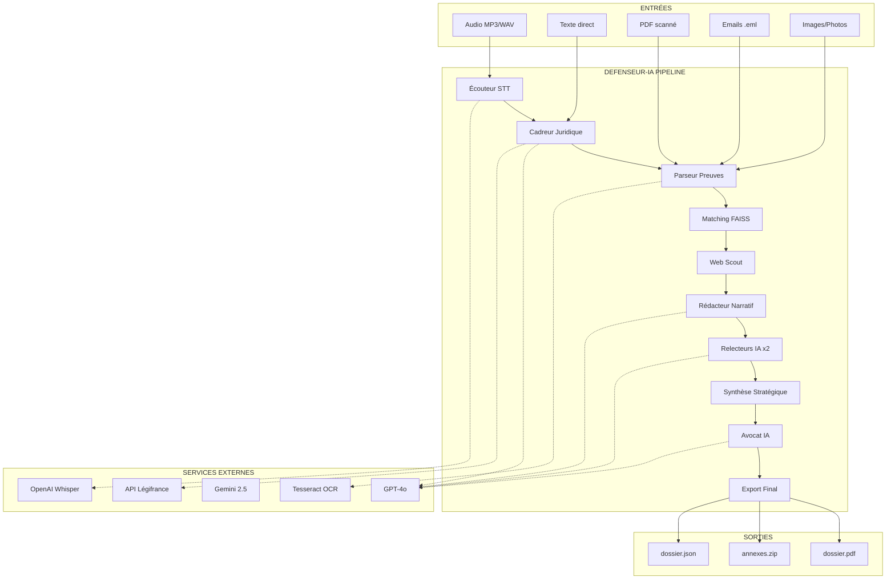
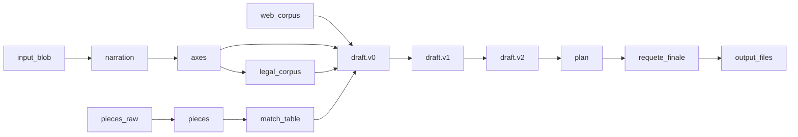

# 00 · OVERVIEW - Architecture DEFENSEUR-IA

> **Document de référence technique**  
> Vision globale, flux de données, choix architecturaux et intégrations externes

---

## 🎯 1. Vision & Objectifs

### 1.1 Problème résolu

| 🚫 **Situation actuelle** | ✅ **Avec DEFENSEUR-IA** |
|---------------------------|--------------------------|
| Justiciable isolé face à la complexité juridique | Pipeline IA qui guide étape par étape |
| Preuves dispersées (audio, PDF, emails...) | Centralisation et structuration automatique |
| Recherche manuelle dans les codes | Interrogation intelligente de Légifrance |
| Rédaction amateur des requêtes | Style juridique professionnel |
| Délais serrés (OQTF = 30 jours) | Génération en quelques heures |

### 1.2 Cas d'usage cibles

- **OQTF** (Obligation de Quitter le Territoire Français)
- **Contentieux du droit des étrangers**
- **Recours administratifs** (préfecture, OFPRA)
- **Aide juridictionnelle** (préparation dossiers)
- **Formation juridique** (étudiants, associations)

---

## 🏗️ 2. Architecture globale

### 2.1 Vue système



### 2.2 Stack technologique

| **Couche** | **Choix** | **Justification** |
|------------|-----------|-------------------|
| **Runtime** | Python 3.12 | Écosystème ML/NLP mature |
| **Web Framework** | FastAPI + Uvicorn | Performance async, OpenAPI auto |
| **Orchestration** | Custom Flow Engine | Contrôle fin du pipeline |
| **Persistence** | JSON + File System | Simplicité, pas de BDD complexe |
| **LLM** | OpenAI GPT-4o | Qualité française, API stable |
| **STT** | Whisper + Gemini Live | Complémentarité précision/vitesse |
| **Vector DB** | FAISS (local) | Pas de dépendance cloud |
| **OCR** | Tesseract 5 (Docker) | Open source, multi-langue |
| **PDF** | WeasyPrint | HTML→PDF, contrôle styling |
| **Packaging** | Poetry | Gestion deps moderne |

---

## 🔄 3. Flux de données détaillé

### 3.1 SharedStore - État global

```json
{
  "meta": {
    "dossier_id": "OQTF_2024_AF23",
    "langue": "fr", 
    "created_at": "2024-07-26T14:30:00Z",
    "version": 1
  },
  "input_blob": "...",
  "narration": {
    "langue": "fr",
    "segments": [
      {
        "start": 0.0,
        "stop": 15.2, 
        "text": "Je m'appelle Marie Dubois...",
        "emotion": "sad"
      }
    ]
  },
  "axes": [
    {
      "id": "axe_1",
      "axe": "violation du droit à la vie familiale",
      "priorite": 5
    }
  ],
  "legal_corpus": [
    {
      "cid": "LEGITEXT000006070721",
      "num": "L.511-1",
      "titre": "Code de l'entrée et du séjour...",
      "texte_html": "<p>L'étranger ne peut être éloigné...</p>",
      "source_url": "https://legifrance.gouv.fr/...",
      "fond": "CODE"
    }
  ],
  "pieces": [
    {
      "id_piece": "piece_001",
      "annexe_num": "Annexe 1",
      "type_piece": "pdf",
      "titre": "Contrat de travail",
      "texte_anonymise": "PERSON_X travaille chez COMPANY_Y depuis...",
      "meta_extra": {"pages": 3, "ocr_confidence": 0.94}
    }
  ],
  "draft": {
    "v0": {
      "version": "v0",
      "texte_markdown": "# Contexte\n\nMadame PERSON_X...",
      "tokens_llm": 1250
    },
    "v1": {
      "version": "v1", 
      "texte_markdown": "# Contexte (version corrigée)\n\n...",
      "tokens_llm": 1180,
      "suggestions": ["Ajouter date précise", "Clarifier lien familial"]
    },
    "latest": "v1"
  },
  "plan": {
    "angles": [
      "Droit à la vie familiale (art. 8 CEDH)",
      "Ancienneté de présence (5+ années)", 
      "Attaches locales (emploi, logement)"
    ],
    "scoring": [
      ["Vie familiale", 85],
      ["Ancienneté", 70],
      ["Attaches", 60]
    ],
    "roadmap": [
      "Rassembler preuves vie familiale",
      "Documenter parcours professionnel",
      "Requête en annulation OQTF"
    ]
  },
  "requete_finale": {
    "titre": "Requête en annulation OQTF - Mme PERSON_X",
    "corps_markdown": "# DEVANT LE TRIBUNAL ADMINISTRATIF\n\n## REQUÊTE...",
    "annexes": ["piece_001.pdf", "piece_002.pdf"]
  },
  "logs": {
    "history": [
      "2024-07-26T14:30:05 ▶ START écouteur",
      "2024-07-26T14:30:12 ✅ END écouteur (7.2s)",
      "2024-07-26T14:30:12 ▶ START cadreur_juridique",
      "2024-07-26T14:30:28 ✅ END cadreur_juridique (16.1s)"
    ]
  }
}
```

### 3.2 Cycle de vie d'une clé



---

## 🤖 4. Catalogue des agents

### 4.1 Pipeline séquentiel

| **ID** | **Agent** | **Input principal** | **Output principal** | **Service externe** | **Durée moy.** |
|:------:|-----------|-------------------|-------------------|-------------------|----------------|
| **0** | Écouteur | `input_blob` | `narration` | Whisper/Gemini | 5-15s |
| **1** | Cadreur Juridique | `narration` | `axes`, `legal_corpus` | Légifrance API | 10-20s |
| **3** | Parseur Preuves | fichiers bruts | `pieces[]` | Tesseract | 2-30s/doc |
| **4** | Juriste Matching | `pieces` + `legal_corpus` | `match_table` | FAISS | 5-10s |
| **5** | Web Scout | `axes` | `web_corpus` | Scraping | 15-30s |
| **6** | Rédacteur Narratif | tout ce qui précède | `draft.v0` | GPT-4o | 20-40s |
| **7** | Relecteur IA #1 | `draft.v0` | `draft.v1` | GPT-4o | 15-25s |
| **7b** | Agrégateur | `draft.v1` + `axes` | `draft.v1b` | - | 2-5s |
| **8** | Relecteur IA #2 | `draft.v1b` | `draft.v2` | GPT-4o | 15-25s |
| **9** | Synthèse Stratégique | `draft.v2` + corpus | `plan` | - | 5-10s |
| **10** | Avocat IA | `plan` + `draft.v2` | `requete_finale` | GPT-4o | 30-60s |
| **11** | Export Final | `requete_finale` + `pieces` | PDF + ZIP | WeasyPrint | 5-15s |

### 4.2 Gestion des erreurs

```python
class DefenseurIAException(Exception):
    """Exception de base"""
    pass

class STTQuotaExceeded(DefenseurIAException):
    """Quota Whisper/Gemini dépassé"""
    pass

class LegifrangeTooManyRequests(DefenseurIAException):
    """Rate limit Légifrance (30/min)"""
    pass

class OCRProcessingFailed(DefenseurIAException):
    """Échec traitement OCR"""
    pass
```

**Stratégies de récupération :**
- **Retry avec backoff** exponential pour APIs
- **Fallback engines** (Whisper → Gemini)
- **Partial success** : sauvegarder état partiel
- **Manual intervention** : pause + reprise avec `--step`

---

## 🔌 5. Services externes & quotas

### 5.1 OpenAI

| **Service** | **Modèle** | **Usage** | **Limite** | **Coût estimé** |
|-------------|------------|-----------|------------|-----------------|
| Audio API | whisper-1 | Transcription | 25 MB/fichier | $0.006/min |
| Chat API | gpt-4o | Rédaction juridique | Selon plan | $0.03/1K tokens |
| Chat API | gpt-4o-mini | Anonymisation | Selon plan | $0.0001/1K tokens |

### 5.2 Google Gemini

| **Service** | **Modèle** | **Usage** | **Limite** | **Coût estimé** |
|-------------|------------|-----------|------------|-----------------|
| Gemini Live | 2.5-flash-preview | STT streaming | 60 req/min | Gratuit (beta) |
| Generate API | gemini-pro | LLM fallback | 60 req/min | $0.001/1K tokens |

### 5.3 API Légifrance

| **Endpoint** | **Usage** | **Quota sandbox** | **Quota prod** |
|--------------|-----------|------------------|----------------|
| `/search` | Recherche codes/lois | 30 req/min | 100 req/min |
| `/consult/getArticle` | Contenu article | 30 req/min | 100 req/min |
| `/consult/legiPart` | Texte complet | 30 req/min | 100 req/min |

**⚠️ Gestion des quotas :**
```python
import asyncio
from datetime import datetime, timedelta

class RateLimiter:
    def __init__(self, max_requests: int, time_window: int):
        self.max_requests = max_requests
        self.time_window = time_window
        self.requests = []
    
    async def acquire(self):
        now = datetime.now()
        # Nettoyer les requêtes anciennes
        self.requests = [req for req in self.requests 
                        if now - req < timedelta(seconds=self.time_window)]
        
        if len(self.requests) >= self.max_requests:
            sleep_time = self.time_window - (now - self.requests[0]).seconds
            await asyncio.sleep(sleep_time)
        
        self.requests.append(now)
```

---

## 🗄️ 6. Persistence & State Management

### 6.1 Architecture fichiers

```
output/
├── dossier_OQTF_AF23.json      # SharedStore principal
├── dossier_OQTF_AF23.pdf       # Export final
├── dossier_OQTF_AF23.zip       # Archive complète
└── pieces/                      # Pièces brutes + OCR
    ├── piece_001_original.pdf
    ├── piece_001_ocr.txt
    ├── piece_002_email.eml
    └── piece_003_scan.jpg
```

### 6.2 Versioning du SharedStore

```python
class SharedStore:
    VERSION = 1
    
    def __init__(self):
        self.data = {
            "meta": {
                "version": self.VERSION,
                "schema_version": "2024.07.26",
                "created_at": datetime.now().isoformat()
            }
        }
    
    @classmethod 
    def load(cls, path: str) -> 'SharedStore':
        with open(path) as f:
            data = json.load(f)
        
        # Migration automatique si version < actuelle
        if data.get("meta", {}).get("version", 0) < cls.VERSION:
            data = cls._migrate(data)
        
        instance = cls()
        instance.data = data
        return instance
```

### 6.3 Sauvegarde incrémentale

Chaque agent sauvegarde après exécution :
```python
async def exec(self, ctx: NodeContext):
    # Logic de l'agent...
    await ctx.shared.set("ma_cle", resultat)
    # ↑ Auto-sauvegarde dans dossier.json
```

---

## 🌐 7. Architecture réseau (mode serveur)

### 7.1 API REST

```
GET  /health                    # Health check
POST /upload_piece              # Upload pièce jointe  
POST /run_full_flow            # Lancer pipeline complet
GET  /status/{dossier_id}      # État d'avancement
GET  /download/{dossier_id}    # Télécharger résultat
```

### 7.2 WebSocket streaming

```javascript
// Client-side monitoring
const ws = new WebSocket('ws://localhost:8000/stream/dossier_AF23');

ws.onmessage = (event) => {
    const update = JSON.parse(event.data);
    console.log(`Agent ${update.agent} ${update.status}`);
    // update.status: "started" | "progress" | "completed" | "error"
};
```

### 7.3 Déploiement

**Docker Compose** (recommandé) :
```yaml
version: '3.8'
services:
  defenseur-ia:
    build: .
    ports:
      - "8000:8000"
    volumes:
      - ./pieces:/app/pieces
      - ./output:/app/output
    environment:
      - OPENAI_API_KEY=${OPENAI_API_KEY}
      - LEGIFRANCE_ID=${LEGIFRANCE_ID}
    
  tesseract:
    image: tesseractshadow/tesseract4re
    volumes:
      - ./pieces:/workspace
```

---

## 🔒 8. Sécurité & Anonymisation

### 8.1 Protection des données personnelles

```python
class AnonymizationEngine:
    PATTERNS = [
        (r'\b[A-Z][a-z]+ [A-Z][a-z]+\b', 'PERSON_X'),
        (r'\b\d{2}/\d{2}/\d{4}\b', 'DATE_X'),
        (r'\b0[1-9][\d\s]{8,9}\b', 'PHONE_X'),
        (r'\b[A-Z]{1,2}\d{2,3}[A-Z]{2}\b', 'PLATE_X'),
    ]
    
    async def anonymize(self, text: str) -> str:
        # 1. Regex basique
        for pattern, replacement in self.PATTERNS:
            text = re.sub(pattern, replacement, text)
        
        # 2. LLM pour cas complexes  
        response = await openai_client.chat.completions.create(
            model="gpt-4o-mini",
            messages=[{
                "role": "system",
                "content": "Remplace toute donnée personnelle par des placeholders."
            }, {
                "role": "user", 
                "content": text
            }],
            max_tokens=len(text) // 3
        )
        
        return response.choices[0].message.content
```

### 8.2 Audit trail

Chaque action est loggée :
```json
{
  "timestamp": "2024-07-26T14:30:05Z",
  "agent": "ecouteur", 
  "action": "stt_transcription",
  "input_hash": "sha256:abc123...",
  "output_size": 1247,
  "duration_ms": 7200,
  "external_calls": ["openai.audio.transcriptions"]
}
```

---

## 📊 9. Monitoring & Observabilité

### 9.1 Métriques clés

| **Métrique** | **Description** | **Seuil alerte** |
|--------------|-----------------|------------------|
| `pipeline_duration_total` | Temps total du pipeline | > 10 min |
| `agent_error_rate` | % d'échecs par agent | > 5% |
| `external_api_latency` | Latence APIs externes | > 30s |
| `quota_usage_legifrance` | Consommation Légifrance | > 80% |
| `pdf_generation_success` | Taux succès export PDF | < 95% |

### 9.2 Logs structurés

```python
import structlog

logger = structlog.get_logger()

async def transcribe_audio(blob: bytes) -> str:
    logger.info("stt_start", 
                size_mb=len(blob)/1024/1024,
                engine="whisper")
    
    start_time = time.time()
    try:
        result = await whisper_client.transcribe(blob)
        logger.info("stt_success", 
                   duration_s=time.time()-start_time,
                   chars_output=len(result))
        return result
    except Exception as e:
        logger.error("stt_failure", 
                    duration_s=time.time()-start_time,
                    error=str(e))
        raise
```

### 9.3 Dashboard de monitoring

**Grafana + Prometheus** (optionnel) :
- Graphiques temps réel du pipeline
- Alertes sur quotas APIs
- Historique des performances par agent

---

## ⚙️ 10. Configuration & Variables d'environnement

### 10.1 Fichier .env complet

```bash
# === APIS EXTERNES ===
OPENAI_API_KEY=sk-proj-...
GEMINI_API_KEY=AIza...

# Légifrance OAuth2 (sandbox)
LEGIFRANCE_ID=mon_client_id_sandbox
LEGIFRANCE_SECRET=mon_secret_sandbox
LEGIFRANCE_BASE_URL=https://sandbox-api.piste.gouv.fr

# === STOCKAGE ===
PIECES_DIR=./pieces
OUTPUT_DIR=./output
SHARED_STORE_PATH=./dossier.json

# === PERFORMANCE ===
MAX_WORKERS=4
TIMEOUT_STT_SECONDS=120
TIMEOUT_LLM_SECONDS=180
TIMEOUT_OCR_SECONDS=300

# === QUOTAS & RATE LIMITING ===
LEGIFRANCE_MAX_REQUESTS_PER_MINUTE=25
OPENAI_MAX_REQUESTS_PER_MINUTE=60
GEMINI_MAX_REQUESTS_PER_MINUTE=50

# === LOGS ===
LOG_LEVEL=INFO
LOG_FILE=./logs/defenseur-ia.log
STRUCTURED_LOGS=true

# === FEATURES FLAGS ===
ENABLE_WEB_SCRAPING=true
ENABLE_GEMINI_FALLBACK=true
ENABLE_ANONYMIZATION=true
ENABLE_PDF_WATERMARK=false

# === SECURITY ===
ANONYMIZE_LOGS=true
RETAIN_RAW_FILES_DAYS=7
ENCRYPT_SENSITIVE_DATA=false
```

### 10.2 Configuration par environnement

```python
from pydantic_settings import BaseSettings
from typing import Literal

class Settings(BaseSettings):
    # APIs
    openai_api_key: str
    gemini_api_key: str | None = None
    legifrance_id: str
    legifrance_secret: str
    
    # Environnement
    environment: Literal["dev", "staging", "prod"] = "dev"
    debug: bool = False
    
    # Quotas
    legifrance_max_requests_per_minute: int = 25
    openai_max_requests_per_minute: int = 60
    
    # Timeouts
    timeout_stt_seconds: int = 120
    timeout_llm_seconds: int = 180
    
    class Config:
        env_file = ".env"
        case_sensitive = False

# Usage
settings = Settings()
```

---

## 🔄 11. Intégrations futures

### 11.1 Roadmap technique

| **Version** | **Fonctionnalités** | **Délai estimé** |
|-------------|---------------------|------------------|
| **v0.1** | Pipeline de base (agents 0-11) | 4 semaines |
| **v0.2** | API FastAPI + WebSocket | +2 semaines |
| **v0.3** | Interface web (Vue.js) | +3 semaines |
| **v0.4** | Multi-dossiers + auth | +2 semaines |
| **v1.0** | Production ready | +4 semaines |

### 11.2 Extensions possibles

**Backend :**
- **Agent 2** : Analyseur de sentiment (stress, urgence)
- **Agent 12** : Notification automatique (email, SMS)
- **Multi-langue** : Support EN, ES, AR
- **Base vectorielle** : Migration FAISS → Qdrant/Weaviate
- **Cache intelligent** : Redis pour résultats LLM

**Frontend :**
- **Dashboard justiciable** : suivi temps réel
- **Mode avocat** : supervision et validation
- **Templates** : modèles de requêtes par domaine
- **Collaboration** : partage sécurisé entre utilisateurs

**Intégrations :**
- **Calendrier** : génération automatique d'échéances
- **Signature électronique** : intégration DocuSign
- **Stockage cloud** : S3, Google Drive
- **Messagerie** : envoi automatique aux tribunaux

---

## 🧪 12. Tests & Validation

### 12.1 Stratégie de tests

```python
# tests/conftest.py
import pytest
from defenseur_ia.core.shared import SharedStore
from defenseur_ia.core.flow import NodeContext

@pytest.fixture
def shared_store():
    """Store vide pour tests"""
    return SharedStore()

@pytest.fixture  
def sample_narration():
    """Narration type pour tests agents aval"""
    return NarrationJusticiable(
        langue="fr",
        segments=[
            Segment(
                start=0.0,
                stop=10.0,
                text="Je m'appelle Marie et j'ai reçu une OQTF.",
                emotion="sad"
            )
        ]
    )

# tests/agents/test_ecouteur.py
@pytest.mark.asyncio
async def test_ecouteur_text_input(shared_store):
    """Test transcription texte direct"""
    await shared_store.set("input_blob", "Bonjour je suis en difficulté")
    
    ecouteur = EcouteurNode()
    ctx = NodeContext(shared=shared_store)
    await ecouteur.exec(ctx)
    
    narration = await shared_store.get("narration")
    assert narration.langue == "fr"
    assert len(narration.segments) == 1
    assert "difficulté" in narration.segments[0].text

@pytest.mark.asyncio
async def test_ecouteur_audio_whisper(shared_store):
    """Test STT avec fichier audio réel"""
    with open("tests/fixtures/sample_15s.wav", "rb") as f:
        audio_data = f.read()
    
    await shared_store.set("input_blob", audio_data)
    
    ecouteur = EcouteurNode() 
    ctx = NodeContext(shared=shared_store)
    await ecouteur.exec(ctx)
    
    narration = await shared_store.get("narration")
    assert len(narration.segments) > 0
    assert narration.segments[0].text  # Non vide
```

### 12.2 Tests d'intégration

```python
# tests/integration/test_pipeline_e2e.py
@pytest.mark.slow
@pytest.mark.asyncio
async def test_pipeline_complet_oqtf():
    """Test end-to-end avec cas OQTF réel"""
    
    # Input : témoignage OQTF type
    input_text = """
    Je m'appelle Sarah, j'ai 34 ans. Je vis en France depuis 8 ans.
    J'ai reçu une OQTF le 15 mars 2024. Je suis mariée à un Français 
    depuis 3 ans et nous avons un enfant de 2 ans. Je travaille comme
    aide-soignante à l'hôpital depuis 2020.
    """
    
    shared = SharedStore()
    await shared.set("input_blob", input_text)
    
    # Exécution pipeline complet
    flow = Flow()
    await flow.run(shared)
    
    # Vérifications
    assert await shared.get("narration") is not None
    assert len(await shared.get("axes")) > 0
    assert len(await shared.get("legal_corpus")) > 0
    
    requete = await shared.get("requete_finale")
    assert "vie familiale" in requete.corps_markdown.lower()
    assert "article 8" in requete.corps_markdown.lower()  # CEDH
    
    # Fichiers générés
    assert Path("dossier.pdf").exists()
    assert Path("dossier.zip").exists()
```

### 12.3 Tests de charge

```python
# tests/performance/test_load.py
import asyncio
import time

@pytest.mark.asyncio
async def test_concurrent_pipelines():
    """Test 10 pipelines simultanés"""
    
    async def run_pipeline(text: str) -> float:
        start = time.time()
        shared = SharedStore()
        await shared.set("input_blob", text)
        
        flow = Flow()
        await flow.run(shared)
        
        return time.time() - start
    
    # 10 cas différents
    texts = [f"Cas juridique numéro {i}" for i in range(10)]
    
    start_total = time.time() 
    durations = await asyncio.gather(*[
        run_pipeline(text) for text in texts
    ])
    total_time = time.time() - start_total
    
    # Assertions
    assert all(d < 300 for d in durations)  # < 5min chacun
    assert total_time < 400  # < 6min total (parallélisme)
    assert len(durations) == 10
```

---

## 🚀 13. Mise en production

### 13.1 Checklist de déploiement

**Infrastructure :**
- [ ] Serveur avec Python 3.12+ 
- [ ] Docker + Docker Compose installés
- [ ] Stockage persistant (volumes)
- [ ] Reverse proxy (Nginx/Traefik)
- [ ] SSL/TLS configuré
- [ ] Monitoring (Prometheus/Grafana)

**Sécurité :**
- [ ] Variables d'env sécurisées (Vault/K8s secrets)
- [ ] Firewall configuré (ports 80/443 uniquement)
- [ ] Logs anonymisés activés
- [ ] Rotation des secrets API
- [ ] Backup automatique des dossiers

**Performance :**
- [ ] Rate limiting configuré
- [ ] Cache activé (Redis optionnel)
- [ ] Monitoring quotas APIs
- [ ] Alertes seuils dépassés

### 13.2 Docker Production

```dockerfile
# Dockerfile.prod
FROM python:3.12-slim as builder

WORKDIR /app
COPY pyproject.toml poetry.lock ./
RUN pip install poetry && \
    poetry config virtualenvs.create false && \
    poetry install --only=main --no-dev

FROM python:3.12-slim as runtime

# Tesseract pour OCR
RUN apt-get update && \
    apt-get install -y tesseract-ocr tesseract-ocr-fra && \
    apt-get clean && \
    rm -rf /var/lib/apt/lists/*

WORKDIR /app
COPY --from=builder /usr/local/lib/python3.12/site-packages /usr/local/lib/python3.12/site-packages
COPY --from=builder /usr/local/bin /usr/local/bin
COPY src/ ./src/

# Utilisateur non-root
RUN useradd -m -u 1000 defenseur && \
    chown -R defenseur:defenseur /app
USER defenseur

# Volumes
VOLUME ["/app/pieces", "/app/output", "/app/logs"]

EXPOSE 8000
CMD ["uvicorn", "defenseur_ia.server.main:app", "--host", "0.0.0.0", "--port", "8000"]
```

### 13.3 Kubernetes (optionnel)

```yaml
# k8s/deployment.yaml
apiVersion: apps/v1
kind: Deployment
metadata:
  name: defenseur-ia
spec:
  replicas: 2
  selector:
    matchLabels:
      app: defenseur-ia
  template:
    metadata:
      labels:
        app: defenseur-ia
    spec:
      containers:
      - name: defenseur-ia
        image: defenseur-ia:latest
        ports:
        - containerPort: 8000
        env:
        - name: OPENAI_API_KEY
          valueFrom:
            secretKeyRef:
              name: api-secrets
              key: openai-key
        volumeMounts:
        - name: pieces-storage
          mountPath: /app/pieces
        - name: output-storage  
          mountPath: /app/output
        resources:
          requests:
            memory: "512Mi"
            cpu: "500m"
          limits:
            memory: "2Gi"
            cpu: "1000m"
      volumes:
      - name: pieces-storage
        persistentVolumeClaim:
          claimName: pieces-pvc
      - name: output-storage
        persistentVolumeClaim:
          claimName: output-pvc
```

---

## 🎓 14. Glossaire technique

| **Terme** | **Définition** |
|-----------|----------------|
| **Agent** | Nœud du pipeline qui exécute une tâche spécifique |
| **SharedStore** | État JSON partagé entre tous les agents |
| **CID** | Common Identifier (Légifrance) - identifiant stable d'un texte |
| **FAISS** | Facebook AI Similarity Search - base vectorielle locale |
| **STT** | Speech-to-Text - transcription audio → texte |
| **OCR** | Optical Character Recognition - reconnaissance de caractères |
| **OQTF** | Obligation de Quitter le Territoire Français |
| **CEDH** | Convention Européenne des Droits de l'Homme |
| **WeasyPrint** | Moteur de rendu HTML → PDF |

---

## 📖 15. Ressources & Références

### 15.1 Documentation officielle

- **API Légifrance** : https://developer.aife.economie.gouv.fr/
- **Guide de légistique** : https://www.legifrance.gouv.fr/contenu/Media/Files/autour-de-la-loi/guide-de-legistique/
- **OpenAI Audio API** : https://platform.openai.com/docs/guides/speech-to-text
- **FastAPI** : https://fastapi.tiangolo.com/
- **Pydantic v2** : https://docs.pydantic.dev/latest/

### 15.2 Outils de développement

- **Poetry** : https://python-poetry.org/
- **Tesseract** : https://github.com/tesseract-ocr/tesseract
- **FAISS** : https://github.com/facebookresearch/faiss
- **WeasyPrint** : https://weasyprint.org/

### 15.3 Veille juridique

- **Légifrance** : https://www.legifrance.gouv.fr/
- **Dalloz Actualité** : https://www.dalloz-actualite.fr/
- **GISTI** : https://www.gisti.org/ (Groupe d'information et de soutien des immigrés)

---

**📝 Document maintenu par l'équipe DEFENSEUR-IA**  
**Dernière mise à jour : 26 juillet 2024**  
**Version : 1.0**