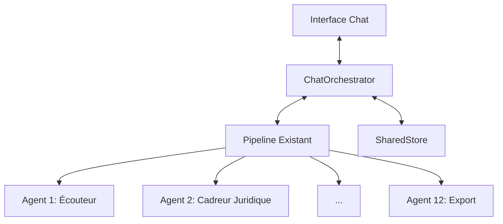

# Plan d'Intégration - Interface Conversationnelle DEFENSEUR-IA

## 📋 Vue d'Ensemble

Intégration d'une interface conversationnelle interactive qui s'interface avec le pipeline existant des 12 agents, en préservant l'architecture actuelle.

## 🎯 Objectifs

- **Non-régressif** : Ne pas impacter le fonctionnement existant
- **Modulaire** : Architecture extensible et maintenable
- **User-friendly** : Interface intuitive et réactive
- **Évolutif** : Peut être enrichi progressivement

## 🏗 Architecture Proposée



## 🚀 Phases d'Implémentation

### Phase 1 : Fondations (1-2 jours)

- [ ] **ChatOrchestrator** de base
  - Gestion des commandes basiques (`/status`, `/start`, `/pause`)
  - Connexion aux endpoints existants
  - Gestion des erreurs basique

- [ ] **Tests d'intégration**
  - Vérification du bon fonctionnement avec le pipeline
  - Tests de charge initiaux

### Phase 2 : Fonctionnalités Essentielles (3-5 jours)

- [ ] **Gestion des documents**
  - Upload via chat
  - Suivi de progression
  - Vérification des formats

- [ ] **Commandes avancées**
  - `/analyse [dossier_id]`
  - `/resultats [dossier_id]`
  - `/historique`

### Phase 3 : Expérience Utilisateur (3-4 jours)

- [ ] **Retours utilisateur enrichis**
  - Barres de progression
  - Notifications en temps réel
  - Prévisualisations des résultats

- [ ] **Gestion des erreurs avancée**
  - Messages d'erreur clairs
  - Suggestions de correction

## 🔄 Points d'Intégration Techniques

### 1. ChatOrchestrator

```python
class ChatOrchestrator:
    def __init__(self, pipeline):
        self.pipeline = pipeline
        self.active_flows = {}
        
    async def handle_message(self, message):
        intent = await self._detect_intent(message)
        return await self._route_intent(intent, message)
```

### 2. Endpoints API à Utiliser

| Endpoint | Méthode | Description |
|----------|---------|-------------|
| `/api/flow/create` | POST | Créer un nouveau flow |
| `/api/flow/execute/{flow_id}` | POST | Exécuter un flow |
| `/api/flow/status/{flow_id}` | GET | Statut d'un flow |

## 📊 Métriques de Succès

- Temps moyen de réponse < 2s
- Taux de réussite des commandes > 95%
- Réduction du temps de traitement moyen
- Satisfaction utilisateur (via feedback)

## 🔄 Rétrocompatibilité

- Toutes les fonctionnalités existantes restent accessibles
- L'interface actuelle n'est pas modifiée
- Les scripts existants continuent de fonctionner

## 🔜 Prochaines Étapes

1. Valider l'architecture technique
2. Commencer l'implémentation de la Phase 1
3. Mettre en place les tests automatisés
4. Déployer en pré-production pour tests utilisateurs
